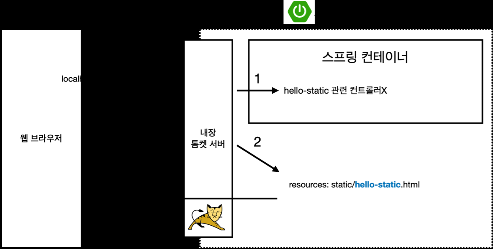

# 정적컨텐츠

## Web을 개발하는 방법
1. 정적 컨텐츠 
   
- 서버에서 특별한 동작없이 파일을 **그대로** 웹브라우저에 보내는 것.
2. MVC와 템플릿엔진
   
- 가장 많이하는 방식. 템플릿엔진은 과거의 JSP,PHP 이런 것들이 템플릿 엔진입니다. 
Html을 그대로 웹브라우저에게 주는게 아닌 서버에서 프로그래밍을 해서 html을 동적으로
   바꿔서 전달해주는 역할을 합니다. 
   
3. API
   
- 만약 안드로이드나 ios 클라이언트와 개발해야되면 서버 입장에서는
json이라는 데이터 포맷으로 내려줍니다. 
  
## 정적 컨텐츠
- 스프링부트는 정적컨텐츠 기능을 자동으로 제공합니다.
  
- 맨처음에는 톰캣서버가 url을 받은 뒤 톰캣서버가 스프링 컨테이너에
  hello-static 관련 컨트롤러에게 찾아갑니다. 없으면
  리소스안 static 안 html을 찾으러 갑니다.
- <https://docs.spring.io/spring-boot/docs/2.3.1.RELEASE/reference/html/spring-bootfeatures.
  html#boot-features-spring-mvc-static-content>
  

- localhost:8080/파일명
  