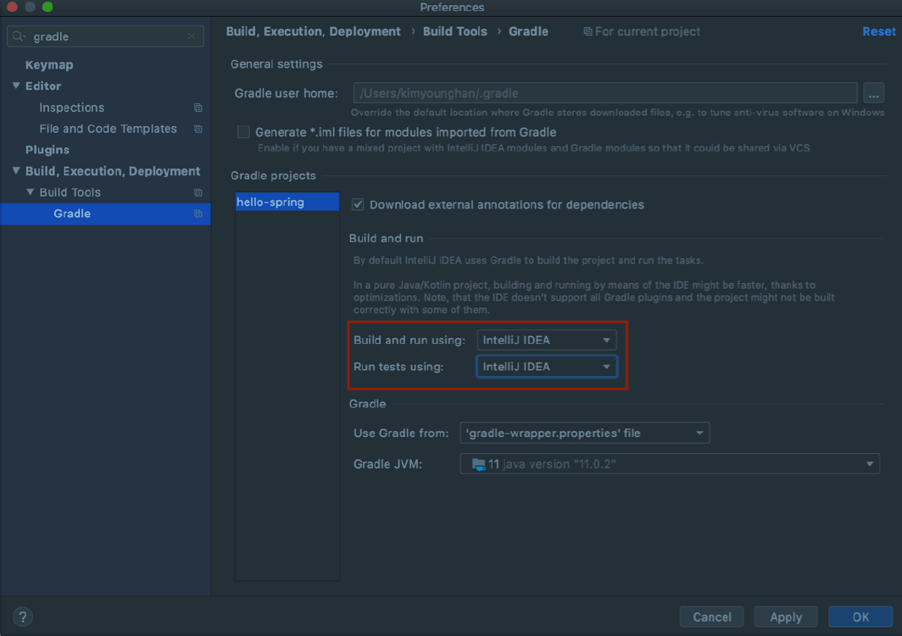

## 프로젝트 생성

### 사전 준비물
- java 11설치
- 인텔리제이
- 스프링부트를 이용하여 스프링 프로젝트 생성
  - 과거:밑바닥부터 스프링 프로젝트 생성
  - 현재:스프링부트를 이용해서 스프링 프로젝트 생성
  - 스프링 부트 스타터: https://start.spring.io

### Spring Initializer
- Project
  - Maven Project: 과거에 많이 사용
  - Gradle Project: 현재 많이 사용
  
- Spring boot
  - 정식 버전을 선택합니다.
  - SNAPSHOT: 아직 만들고 있는 단계
  - M1: 아직 정식 릴리즈되지 않은 버전
  
### Project Metadata
- Group: 보통 기업명, 도메인명 
- Artifact: 빌드된 결과물, 즉 프로젝트 명
- Name: 유지
- Description: 유지
- Packaging: Jar

### Dependencies
- 의미: 어떤 라이브러리를 사용할 건가요? 
- 웹 프로젝트할 경우: spring web, Thymeleaf(html을 만들어주는 템플릿 엔진)

### Generate
- 다운로드를 받습니다.
- 압축을 풉니다.
- 인텔리제이에서 open project
- 프로젝트폴더 -> build.gradle -> open as project

### 프로젝트 구조
- .idea: 인텔리제이 설정 폴더
- gradle: gradle과 관련된 폴더
- src: 
  - 설명: main과 test가 나뉘어 졌다는 건 그만큼 test도 중요하다는
  의미입니다.
  - main
    - java
    - resources: 자바 파일을 제외한 모든 파일들(html, 설정파일)
  - test
    - java
  
- build.gradle: 스프링부트로 자동 생성된 파일. 버전을 설정하고 
라이브러리를 가져옵니다.
  
- .gitignore: 필요없는 파일(ex.빌드된 파일 등)명을 작성하여 git에 올라가지 않도록 
도와주는 파일입니다. 스프링 부트 스타터에서 자동적으로 설정 해줍니다.
  
- gradlew:
- gradlew.bat:
- settings.gradle:

### 실행하기
- main에 있는 HelloSpringApplication를 실행합니다.
- console에 "Tomcat started ~ 8080"이라고 뜹니다.
- 브라우저에 가서 "localhost:8080"을 입력합니다.
- 에러 페이지가 뜨면 성공입니다!
    
### 프로젝트 실행 속도 빠르게 설정하기
- Preferences --> Build, Execution, Deployment --> 
  Build Tools --> Gradle
  - Build and run using: Gradle --> IntelliJ IDEA
  - Run tests using: Gradle --> IntelliJ IDEA
  

