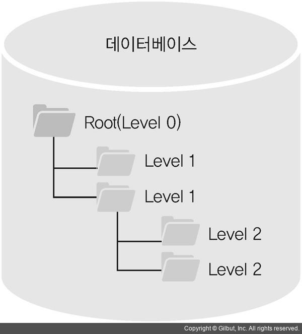
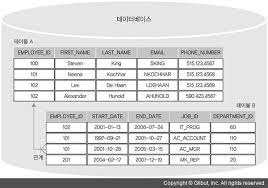
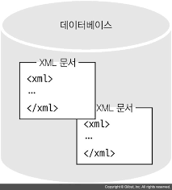
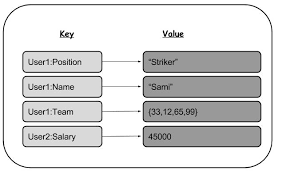

# 다양한 데이터베이스(=DBMS, 데이터베이스 관리 시스템)

## 목표
- DBMS의 종류에는 무엇이 있는지 설명 할 수 있습니다.
- DMBS의 한 종류인 RDBMS(=관계형 데이터베이스)에 대해 설명할 수 있습니다.

### 데이터베이스(=DMBS)는 왜 여러가지 종류가 있나요?
- 데이터베이스의 사용 용도나 이를 제어하는 프로그래밍 환경이 다양하기 때문입니다.

### 관계형데이터베이스(=RDBMS) 란 무엇인가요?
- 데이터베이스 중에서 `SQL`로 데이터를 제어하는 데이터베이스 입니다.

## 데이터베이스(=DBMS) 종류
- 데이터베이스는 `데이터 저장 방법`에따라 여러 가지로 분류할 수 있습니다.

### 계층형 데이터베이스
- `폴더와 파일 등의 계층 구조`로 데이터를 저장하는 데이터베이스입니다.
- 예로 하드디스크가 있습니다.

  
### 관계형 데이터베이스(=RDBMS)
- `행과 열의 표(=table) 형식`으로 데이터를 저장하는 데이터베이스입니다.
- 표 형식 데이터란 2차원 데이터를 말합니다.
- 이러한 표(=table)을 많이 저장하고 이름을 붙여 관리합니다.
- `SQL` 명령어를 통해 데이터를 제어합니다.

### 객체지향 데이터베이스
- 가능하면 `객체를 그대로 데이터베이스의 데이터로` 저장하는 데이터베이스입니다.

### XML 데이터베이스
- `XML 형식으로(=태그를 이용해)` 데이터를 저장하는 데이터베이스입니다. 
- HTML과 유사합니다.

  
### Key-Value 스토어 데이터베이스
- 키와 그에 대응하는 값 형태로 데이터를 저장하는 데이터베이스입니다.
- NoSQL(=Not Only SQL)로 불리며 SQL만을 사용하지 않는 데이터베이스라는 해석이되고
즉, 관계형 데이터베이스를 사용하지 않는다는 의미가 아닌 여러 유형의 데이터베이스를 사용하는 것입니다.
  

---
앞으로 데이터베이스라는 용어는 관계형 데이터베이스(=RDBMS)로 해석합니다.

### RDBMS 사용 시스템
- 과거에는 대형 기기에만 RDBMS를 사용했지만 최근에는 작은 휴대폰까지 RDBMS가 내장되어 있습니다.
    - 예를 들어 안드로이드폰에는 'SQLite'라는 작은 RDBMS가 내장되어 있습니다.
    

### 대표적인 RDBMS 제품

- Oracle
    - 가장 많이 쓰는 RDBMS 중 하나입니다.
    
- SQL server
    - 윈도우 플랫폼에서만 동작합니다.
    
- PostgreSQL
    - 실험적인 기능이 많습니다.
    
- MySQL
    - 요즘 많이 사용하는 RDBMS입니다.
    
- SQLite
    - 임베디드 시스템에 자주 사용됩니다.
    