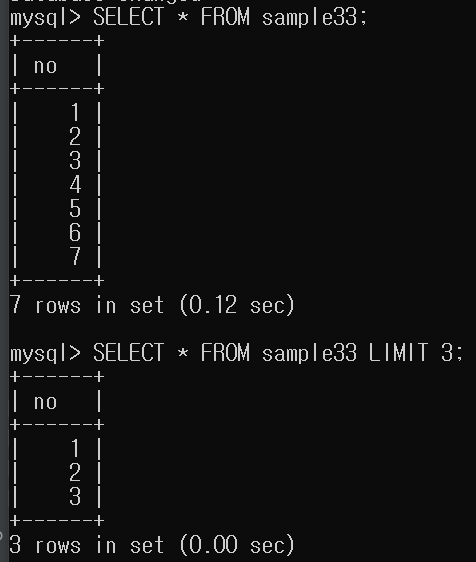

# 11강. 결과 행 수 제한하기

# 문법

```mysql
SELECT 열명 FROM 테이블명 WHERE 조건식 ORDER BY 열명 LIMIT 행수 (OFFSET 시작행)
```

- SELECT 명령의 마지막에 지정합니다.
- WHERE구나 ORDER BY 구의 뒤에 지정합니다.
- 표준 SQL이 아니므로 MySQL과 PostgreSQL에서만 사용가능



## 오프셋 지정
