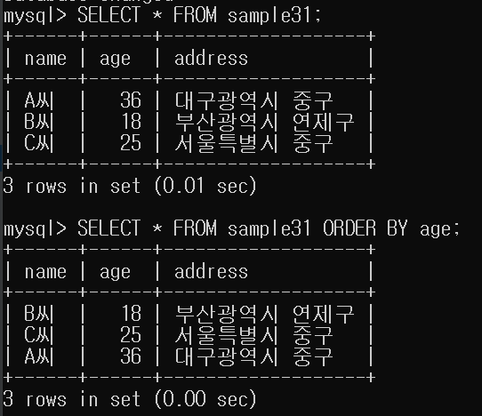
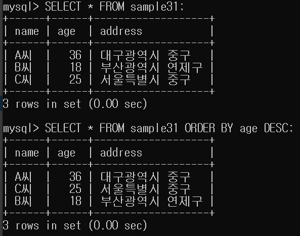

# 9강 ORDER BY로 행 정렬

- SELECT 명령의 `ORDER BY`구를 이용하여 검색 결과의
행 순서를 바꿀 수 있습니다.
- ORDER BY를 하지 않을 경우 저장된 순서대로 반환됩니다.
  
```mysql
SELECT 열명 FROM 테이블명 (WHERE 조건식) ORDER BY 열명
```

## 1.ORDER BY로 오름차순 정렬하기


- age 열로 오름차순 정렬하기


## ORDER BY DESC로 내림차순 정렬하기


- age 열로 내림차수 정렬하기
## 대소관계
- 수치형 데이터 : 1 < 10 < 100...
- 날짜시간형 데이터: 1999년 < 2000년 < ... < 2021년
- 문자열형 데이터: 사전식 순서
    - VARCHAR 형인데 숫자로된 데이터를 주의합니다.
    
## ORDER BY는 테이블에 영향을 주지 X
- SELECT명령은 데이터를 검색하는 명령입니다.
- 즉, 데이터를 참조를 하는 명령이고 변경을 할 수 없습니다.