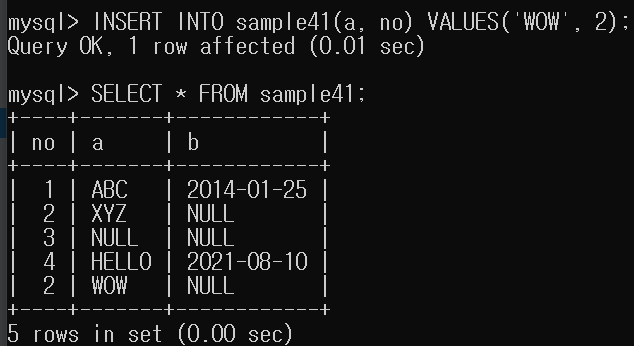

# 16강.데이터 추가하기

``` mysql
INSERT INTO 테이블명 VALUES(값1, 값2, ...)
```
- 데이터를 추가 하기 위해서는 열 정보가 필요합니다. 열정보를 얻기위해선
다음 `DESC` 명령문을 이용하여 열 정보를 확인할 수 있습니다.
    - DESC 테이블명;

- SELECT문
    - 데이터베이스 서버가 클라이언트로 결과를 반환하는 방식입니다.
    
- INSERT INTO문
    - 클라이언트에서 서버로 데이터를 전송하는 방식.
    - 신규등록이나 추가와 같은 버튼을 클릭할 때 발생합니다.
    


---

## 열을 지정하여 데이터 추가하기

```mysql
INSERT INTO 테이블명(열1, 열2, ...) VALUSE(값1, 값2, ...)
```


SSS