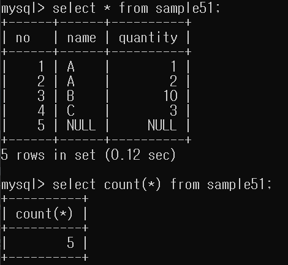
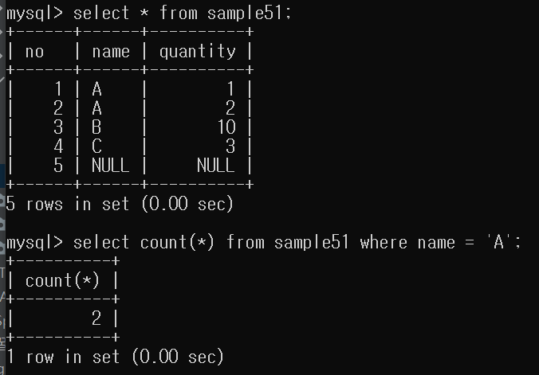
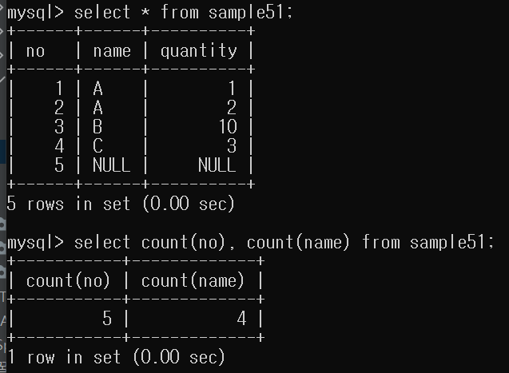

데이터베이스에는 많은 데이터가 있습니다. 이러한 데이터들의 합, 평균, 
갯수, 최대값, 최소값은 의미있는 값입니다.

따라서 이러한 의미있는 값을 구하는 함수가 존재합니다. 이러한 함수를 `집계함수`라고합니다.
일반적으로 함수는 인자로 값을 전달하지만 집계함수는 인자로 집합을 전달합니다.

- 집계: 집합으로부터 하나의 값을 계산하는 것.

집계함수에는 5가지 종류가 있습니다.
- COUNT(): 행 갯수를 구해준다.
- SUM(): 
- AVG()
- MAX()
- MIN()

# 행 개수 구하기 - COUNT()
```mysql
SELECT COUNT(*) FROM 테이블
```

- *는 모든 열을 의미하는 메타문자입니다.
- 모든 열은 테이블의 전체 즉 테이블을 의미합니다.

---

## 1.테이블 전체 행 갯수 구하기



- 테이블의 모든 행 갯수 구하기

---

## 2.조건에 맞는 행 갯수 구하기



- WHERE 구 이용해서 특정 행 갯수 구하기

---

## 3.열로 행 갯수 구하기



- 열을 이용해서 행 갯수를 구할 수 있다.
- 이때 NULL은 행 갯수에서 제외된다.
- 다만 *은 NULL 값이 있어도 행 갯수에 포함됩니다.

---

## 4.중복을 제외한 행 갯수 구하기


- 예약어 DISTINCT 사용
- NULL을 제외한 중복이 포함되지 않은 행의 갯수
- ALL은 중복을 포함한다.

