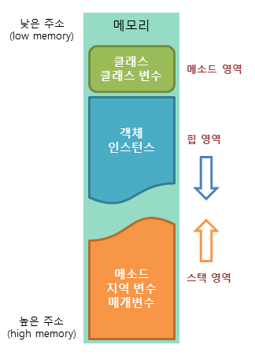
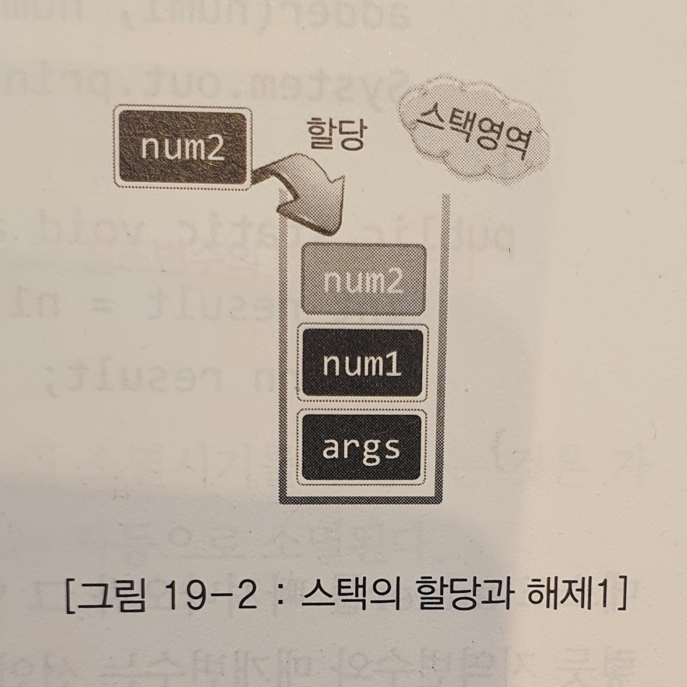
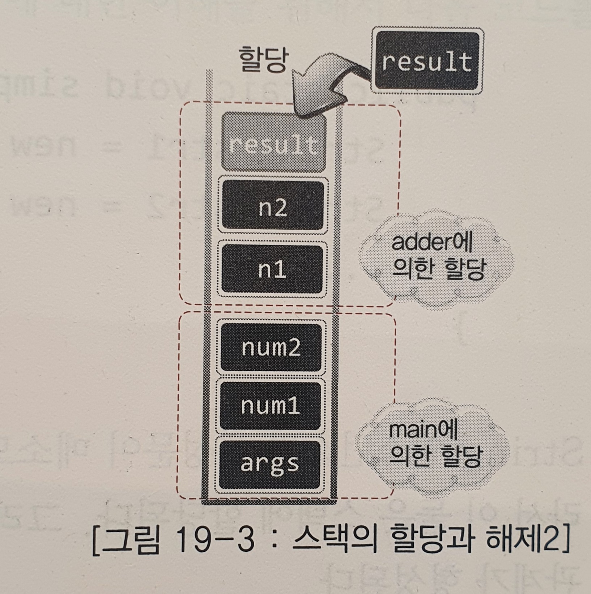
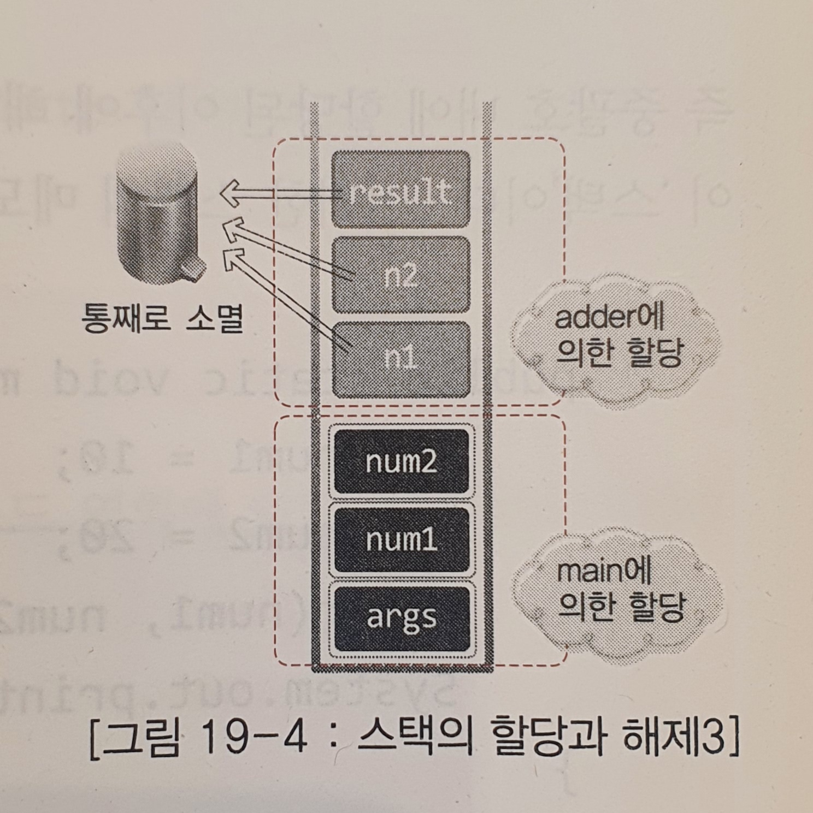
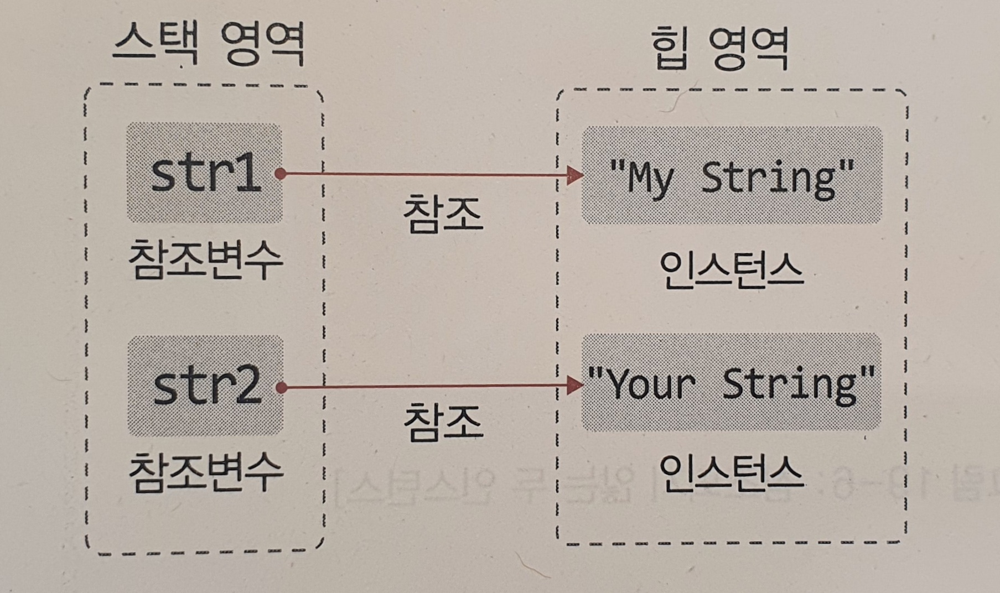
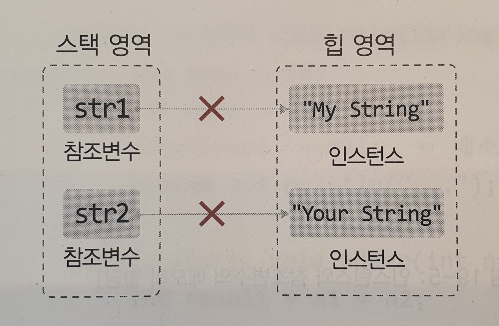

# 자바 메모리 모델
- 자바 메모리 모델: JVM의 메모리 관리 방식을 일컫는 말.
- 자바를 이해하는데 있어서 중요합니다.

## 1. JVM의 메모리 모델

- JVM은 운영체제 위에서 실행되는 하나의 프로그램입니다.
- 자바 프로그램은 JVM 위에서 실행되는 프로그램입니다.

### 그렇다면 `JVM 실행에 필요한 메모리는 어떻게 제공될까?`

프로그램이 실행될 때 필요한 메모리 공간을 `메인 메모리(Main memory)`라고 합니다.
이는 물리적으로 보면 램(ram)에 저장됩니다.

윈도우와 리눅스와 같은 운영체제가 이 메인 메모리를 관리합니다. 다시 말해서,
운영체제가 응용 프로그램에게 메모리를 할당(=제공)합니다. 간단하게 대화를 통해 이해 해보겠습니다.

```java
응용프로그램 A: 메모리 할당해줘
운영체제: ㅇㅋ 4G 바이트 할당해드림

응용프로그램 B: 나도 메모리 할당 좀
운영체제: ㅇㅋ 4G 바이트 할당해줄게

자바 가상머신: 난 JVM이니깐 메모리 특별하게 할당해줘
운영체제: ? 너도 걍 응용프로그램임 ㅇㅇ 4G 받으셈
```

자 그럼 이제 위에 질문(`JVM 실행에 필요한 메모리는 어떻게 제공될까?`)에
대해 답할 수 있을 것입니다. 즉 JVM은 운영체제가 할당해주는 메모리 공간을
기반으로 스스로를 실행하면서 더불어 응용 프로그램의 실행도 도와줍니다.

### JVM의 메모리 살림살이

운영체제로부터 메모리 공간을 할당받은 JVM은 이제 메모리 공간을 어떻게
`효율적`으로 사용할지 고민합니다. 여기서 효율적으로 공간을 사용하려면 어떻게
해야될까요? 예를들면 수납장은 `공간을 나누어` 효율적으로 수납합니다.

즉, JVM도 메모리 공간을 `데이터 특성`에 따라 공간을 나누어 효율적으로 사용합니다.
메모리 공간은 다음과 같이 나눕니다.



위의 그림과 같이 JVM의 메모리 모델은 크게 3개의 영역으로 나눌 수 있습니다.
그리고 각각의 영역에서는 다음과 같은 데이터를 저장합니다.
- 메소드 영억(Method Area): 메소드의 바이트 코드, static 변수, 클래스, 클래스 변수
- 스택 영역(Stack Area): 지역변수(local variable), 매개변수(parameter), 메소드
- 힙 영역(Heap Area): 인스턴스, 객체

### 메소드 영역(Method Area)
우리는 평소에 .java라는 소스파일을 컴파일하면 .class라는 파일이 생기는 걸 알고있습니다.
 이때 .class 파일 안 코드를 가리켜 `바이트코드(Bytecode)`라고 합니다.
이 바이트 코드도 JVM의 메모리 공간에 존재해야 프로그램을 실행 할 수 있습니다.

```java
Class Boy{
    static int average = 0;
    public void Run(){}
}
class MyMain{
    public static void main(String[] args){
        Boy b = new Boy();  // 인스턴스 생성
        Boy.average += 5;   // 클래스 변수 접근
    }
}        
```

위의 코드 중 main을 보면 Boy 인스턴스를 생성하고 클래스 변수에 접근하고 있습니다.
이렇듯 인스턴스 생성 및 클래스 변수에 접근하기 위해선 해당 클래스의 `바이트코드`가 메모리 공간에
로딩(=올려져)되어야 한다. 이때 메소드 영역에 올라가게 된다. 즉 메소드 영역에는 `특정 클래스의 정보(=static 변수)`, `바이트 코드`가 
올라갑니다.


### 스택 영역(Stack Area)

스택 영역에는 `지역변수`와 `매개변수`가 저장됩니다. 이 두 변수의 공통점은
`중괄호로 구분되는 지역 내에서만 유효한 ` 변수라는 점입니다.

즉 스택이란 `중괄호 내에 할당된 이후 중괄호를 벗어나면 바로 소멸되는 특성을 지닌` 데이터들의
저장을 위한 공간입니다.

다음 그림을 보고 설명을 이어하겠습니다.

``` java
public static void main(String[] args){
    int num1 = 10;
    int num2 = 20;  // 현재 실행 위치
    adder(num1, num2);
    System.out.println("end of program");
}
public static void adder(int n1, int n2){
    int result = n1 + n2;
    return result;
}
```

스택에는 지역변수와 매개변수가 저장되므로 현재 실행 위치에서의 
스택의 상태는 다음과 같습니다.



이후 다음과 같이 메소드가 호출되고 현재 실행 위치가 바뀌었을 때
스택의 상태는 다음과 같습니다.

``` java
public static void main(String[] args){
        int num1 = 10;
        int num2 = 20;  
        adder(num1, num2);  // 메소드가 호출되고
        System.out.println("end of program");
        }
public static void adder(int n1, int n2){
        int result = n1 + n2;   // 현재 실행 위치
        return result;
        }
```



main 메소드가 아직 종료되지 않은 상태이기에 main 메소드에서 선언된
변수들 위에 adder 메소드에서 선언된 변수들이 순서대로 쌓인 상태입니다.

그럼 이제 변수 result에 저장된 값을 반환하면서 메소드를 빠져나간 이후의
스택 상태를 보겠습니다.

``` java
public static void main(String[] args){
        int num1 = 10;
        int num2 = 20;  
        adder(num1, num2);  // 메소드가 반환되고
        System.out.println("end of program");   // 현재 실행 위치
        }
public static void adder(int n1, int n2){
        int result = n1 + n2;
        return result;
        }
```



메소드 adder을 빠져나오면서 adder 중괄호 안에서 선언되었던 지역변수와
매개변수들이 모두 스택에서 소멸되었습니다. 이렇게 지역변수와 매개변수는
선언되는 순간에 스택에 할당되었다가 자신이 할당된 영역을 벗어나면 스택에서
소멸됩니다.


### 힙 영역(Heap Area)

힙 영역에는 `인스턴스`가 할당됩니다. 그렇다면 `왜 인스턴스는 스택이 아닌
힙이라는 별도의 영역에 할당되는 걸까요?`

그 이유는 바로 인스턴스의 `소멸 시점과 소멸 방법`이 지역변수와 다르기 때문입니다.
앞서 말한것처럼 `데이터의 성격`이 다르면 할당되는 공간도 달라야 합니다.

코드를 통해 이해해 보겠습니다.

```java
public static void simpleMethod(){
    String str1 = new String("My String");
    String str2 = new String("Your String");
    ....
}
```

위의 코드에서 참조변수 str1, str2는 메소드안에 선언된 지역 변수 입니다.
따라서 str1과 str2는 스택에 할당됩니다. 그러나 인스턴스는 힙에 할당되니
메모리 공간에서 다음과 같은 참조관계가 형성됩니다.



그렇다면 힙에 생성된 인스턴스들은 언제 소멸될까요? 힙의 소멸시기를 결정하는건
바로 JVM입니다. JVM은 참조변수가 인스턴스를 참조하는 상태가 끊어졌을 때(str1 = null)
인스턴스를 소멸시킵니다. 왜냐하면 참조관계 끊어지면 끊어진 인스턴스는 더 이상
접근할 수 없게 되고 그렇게 되면 존재할 이유가 없게 되기 때문입니다.



이렇게 자바의 인스턴스 소멸 방식을 가리켜 `가비지 컬렉션(Garbage Collection)`이라고 합니다.
이는 프로그래밍 편의를 도와주는 자바의 특별한 기능힙니다. 정리하면,
힙 영역은 JVM에 의한 가비지 컬렉션이 일어나는 메모리 공간입니다.

참고로 인스턴스가 참조되지 않았을 때(=가비지 컬렉션의 대상이되는 시점)와 가비지 컬렉션이 발생하는 때(=인스턴스 소멸)는 다릅니다.
가비지 컬렉션이 자주 일어나면 시스템 성능에 부담이 되기때문에 `실행`타이밍은 별도로 알고리즘이 되어있습니다.
