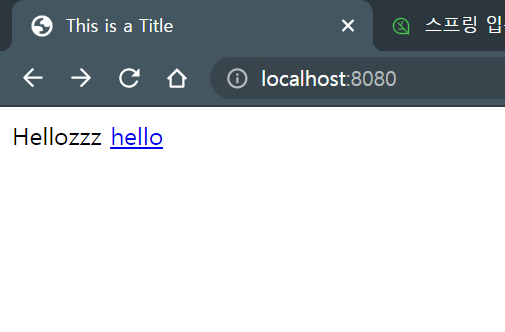
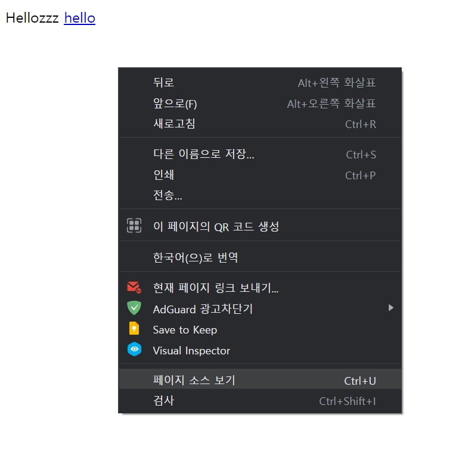
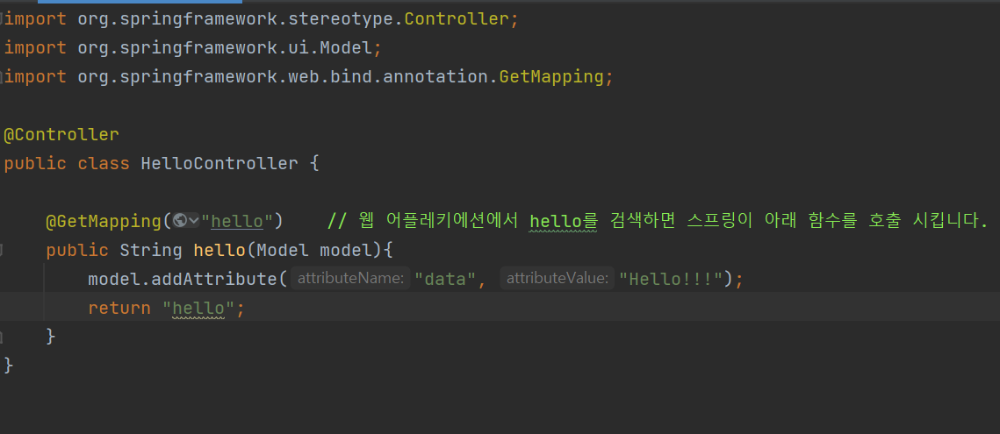
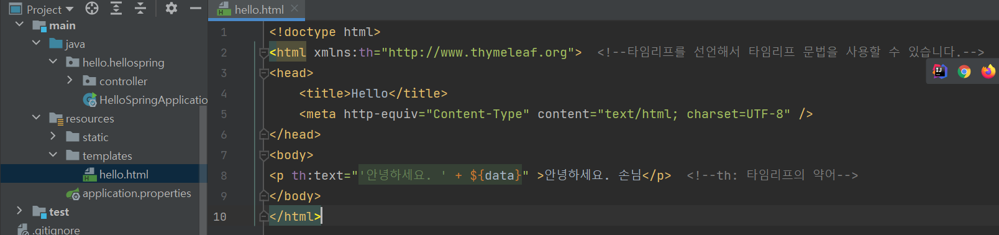

## View 환경설정

### Welcome 페이지 만들기
- resources/static/index.html에 넣어주면 자동으로 웰컴페이지로 인식합니다.
    - 웰컴페이지란 도메인만 눌렀을 때 들어가지는 첫 페이지입니다.
  
- ! + tap후 만들어진 html 형식을 저장하고 서버를 다시 실행해 봅시다.

  

####팁: 페이지 소스보는법

### 거대한 스프링
- 스프링은 웹과 관련된 많은 기능을 가지고 있어 모든 기능을 암기할 수 없습니다.
  - 따라서 필요한 시점에 적절히 기능을 찾는 능력이 중요합니다.
  - 예를들면,welcom 페이지 어떻게 만들지? spring 홈페이지 --> Project --> Spring boot -> Learn --> 해당 버전 --> ref doc --> spring boot features --> ctrl + f 
  --> welcome...
    
### thymleaf 템플릿 엔진 
- 동작하고 프로그래밍되는 화면을 만들기 위해 사용합니다.
- hello.hellospirng 아래에 controller 패키지를 만듭니다.
- 그 안에 HelloController 클래스를 만듭니다.
  - 클래스이름 위에 "@Controller(어노테이션)"을 적어야합니다.
  - 사진과 같이 작성합니다.
  
    
- templates 폴더로 갑니다.
  - hello.html을 만듭니다.
  - 사진과 같이 작성합니다.
  
    
- 실행해서 확인합니다

  
    
