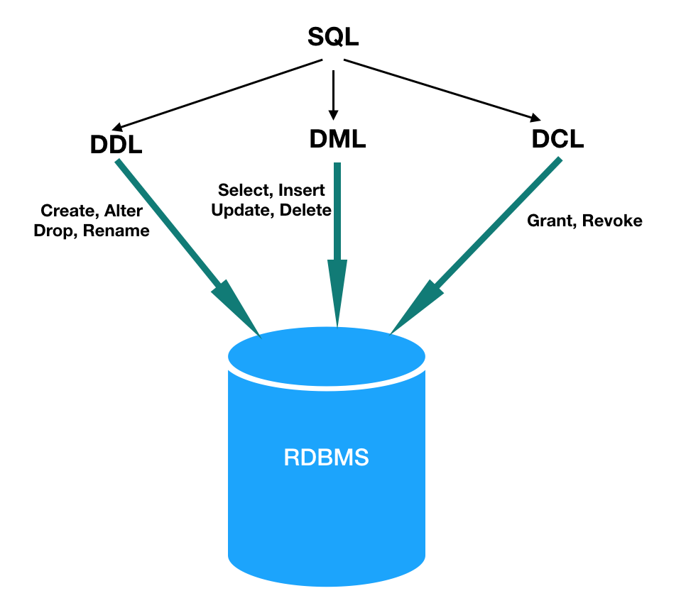

# 데이터베이스(DB, Database)란 무엇인가요?
- 특정 데이터를 확인하고 싶을 때, 간단하게 찾을 수 있도록
`정리된 형태의 데이터 집합`을 의미합니다.
  
## DBMS(Database Management System, 데이터베이스 관리 시스템)란 무엇인가요?
- `데이터베이스를 효율적으로 관리하는` 소프트웨어입니다.
- DBMS를 사용하는 이유는 생산성 향상과 기능성, 신뢰성 확보입니다.
    - 생산성
        - 어느 시스템이든 CRUD와 같은 처리가 필요한데 이러한 기본 기능을
    DBMS가 제공합니다.
          
    - 기능성
        - 데이터베이스를 다루는 기능을 많이 제공합니다.
            - 예) 대용량 데이터를 저장하고 빠르게 검색하는 기능 등
    - 신뢰성
        - 컴퓨터를 여러 대 두고 확장성과 부하 분산을 구현합니다.
    

## SQL란 무엇인가요?
- 관겨형 데이터베이스(RDBMS)과 대화를 하기위해(=접근하기 위해) 사용하는 언어입니다.

### SQL 명령어의 종류에는 무엇이 있나요?
- SQL 명령어는 3가지가 있습니다.
1. DML(Data Manipulation Language)
    - 데이터베이스에 데이터를 CRUD할 때 사용하는 명령어 입니다.
    
2. DDL(Data Definition Language)
    - 데이터베이스는 '데이터 베이스 객채'라는 데이터 그릇을 이용하여 데이터를 관리합니다.
    - 이 같은 객체를 만들거나 삭제하는 명령어 입니다.
    
3. DCL(Data Control Language)
    - 데이터를 제어하는 명령어입니다.
    - DCL에는 트랙젝션을 제어하는 명령어와 데이터 접근권한을 제어하는 명령이 있습니다.
    

