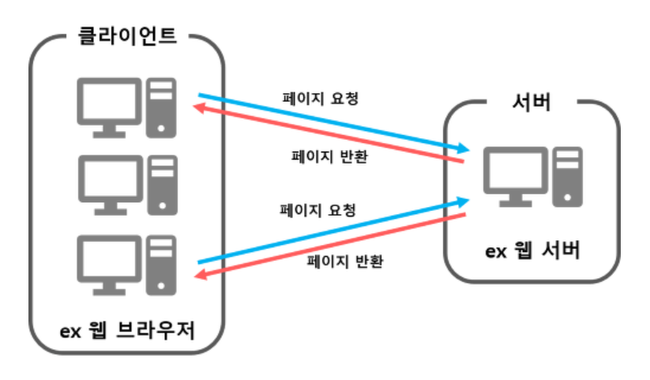
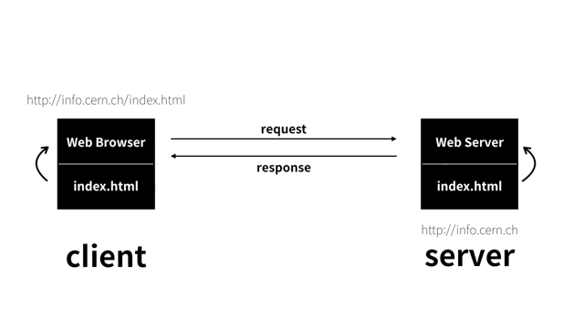
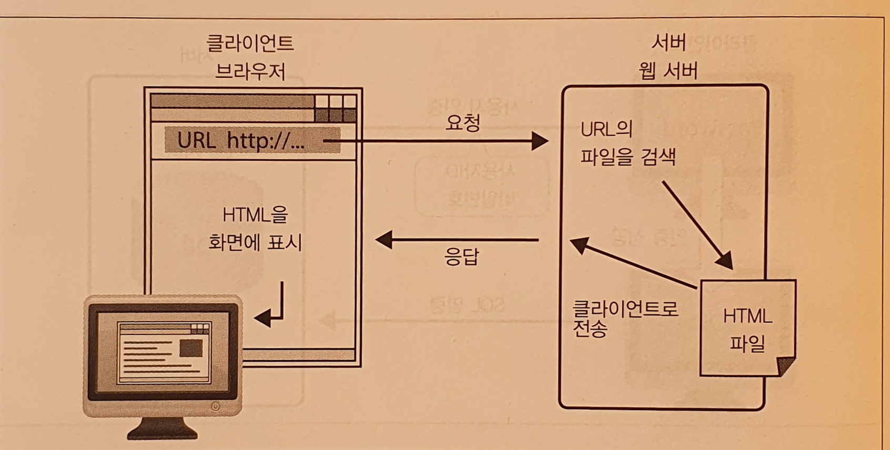
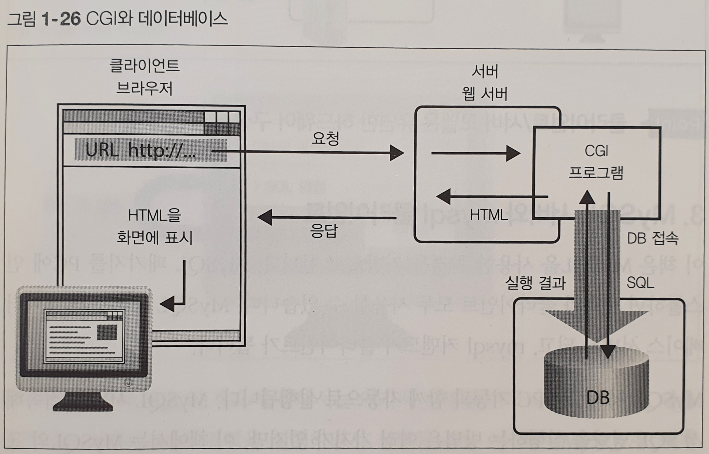
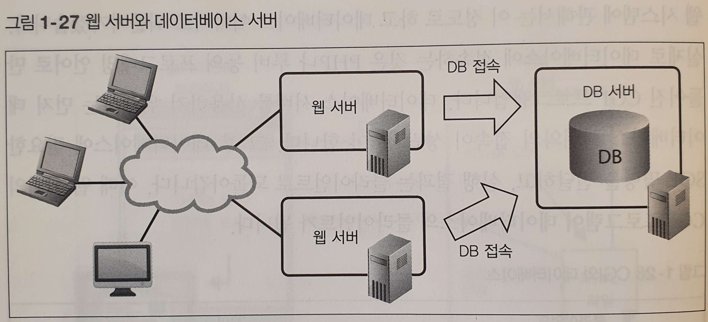

# 데이터베이스 서버(DB Server)

- `RDBMS`는 복수의 클라이언트가 보내는 `요청(=request)`에 `응답(=answer)`할 수 있도록 클라이언트
서버 모델로 동작합니다.
  
- `클라이언트(=client)`는 서버에 접속 요청이나 SQL 명령 실행 요청을 보낼 수 있습니다.
- `서버(=server)`는 이를 처리하고 클라이언트에 그 결과를 반환합니다.

## 1. Client-Server 모델이란 무엇인가요?
클라이언트/서버 모델이란 사용자 조작에 따라 요청을 전달하는 `클라이언트`와 해당 요청을
받아 처리하는 `서버`로 소프트웨어를 나누고, 복수의 컴퓨터 상에서
하나의 모델을 구현하는 `시스템`을 말합니다.

### - 웹 시스템에서의 Client&Server
웹시스템(Web System)이란 `브라우저`와 `웹 서버`로 구성되는 클라이언트/서버 모델의 시스템입니다.

웹에서 클라이언트 기능을 하는 브라우저는 사용자가 지정한 URL과 연결된 웹
서버에 요청을 보냅니다. 요청 내용은 상황에 따라 다르지만, 대부분은 '이 페이지를 열람하고 싶다'
는 요청입니다. 이러한 클라이언트의 요청(요구사항)을 웹 용어로는 `request`라고 합니다.

클라이언트의 요청을 받은 웹 서버는 url을 보고 적절히 처리합니다. 요청이 '이 페이지를 열람하고 싶다'이므로, 서버는 브라우저가 보고싶어하는
페이지의 HTML 데이터를 반환합니다. 데이터는 네트워크를 통해 전송됩니다.

### - RDBMS의 Client&Server

RDBMS도 웹 시스템처럼 클라이언트와 서버로 시스템이 구성됩니다. 하지만 다른 점이 있다면,
RDBMS는 `사용자 인증`이 필요합니다. 이를 통해 RDBMS는 사용자 별로 데이터베이스의 접근을 제한할 수 있습니다.
사용자 인증은 사용자 ID와 비밀번호로 실행됩니다.

### -SQL 명령어 실행
사용자 인증을 하면 클라이언트는 DB 서버에 SQL 명령을 보낼 수 있습니다.

## 2.웹 애플리케이션의 구조를 설명해주세요

웹 애플리케이션은 일반적으로 웹 서버와 데이터베이스 서버의 조합으로 구축됩니다.
여기서는 웹 애플리케이션의 구동원리에 대해 살펴보겠습니다.

웹 시스템의 요청과 응답

웹 사이트가 정적인 HTML으로만 구성되어 있다면 웹 서버만으로도 시스템을 구축 할 수 있습니다.
하지만 웹 어플리케이션이라 부를 정도의 규모라면 데이터베이스가 필요합니다.

웹 서버에서 동적인 HTML을 생성하려면 제어용 프로그램이 필요합니다.
웹 서버에는 CGI라 불리는 동적 콘텐츠 확장 방식이 있습니다.
이 CGI를 이용하여 프로그램과 웹 서버 간을 연동, 통신하여 처리합니다.

프로그래밍 언어로서는 펄이나 PHP, 루비 등의 스크립트 언어가 자주 사용됩니다.
 윈도우의 경우 ASP.NET이 많이 사용되며, 자바와 Servlet과 같은 조합도 있습니다.

실제로 데이터베이스에 접속하는 것은 php나 루비 등의 프로그래밍 언어로 만들어진
CGI 프로그램입니다. 데이터베이스 서버를 사용하기 위해서는 먼저 데이터베이스
서버와의 접속이 되어야합니다. 그 후 데이터베이스에 필요한 SQL 명령을 요청하고
실행 결과는 클라이언트로 돌아갑니다. 이때 웹 서버의 CGI 프로그램이 데이터베이스의 클라이언트가 됩니다.

클라이언트와 서버가 네트워크로 연결되어 있다면 서로 다른 컴퓨터에 두어도 무방합니다.
웹 서버와 데이터베이스 서버를 다른 컴퓨터에다가 두면 처리가 분산되어 시스템 전체 성능이
향상됩니다.

## 3.MySQL 서버와 mysql 클라이언트

실습은 MySQL을 사용할 예정입니다. MySQL 패키지를 설치하면 서버와 클라이언트 모두 사용
 할 수 있습니다. MySQL 서비스가 데이터베이스 서버가 되고, mysql 커맨드가 클라이언트가 됩니다.

MySQL 서비스는 PC 기동과 함께 자동으로 실행됩니다. MySQL 서버에 접속해서 SQL 명령을 실행하는 방법은
여러 가지가 있지만, 저는 MySQL 표준 커맨드인 mysql 클라이언트를 이용할 예정입니다.

PC 한 대로 클라이언트와 서버 모두 실행할 수 있지만 네트워크 기능은 필요합니다. 클라이언트에서
서버에 접속할 필요가 있는데, 이때 네트워크를 경유해서 PC의 서버로 되돌아오는 형태로 접속합니다.
이를 `루프 백 접속`이라 부릅니다.

### 1장(데이터베이스와 SQL) 용어 정리
- 데이터베이스
  - 비 휘발성 저장장치에 저장되는 영속된 데이터의 집합. 단순히 저장만 하는게 아닌
 용이한 검색을 실현하도록 정리해준다.
- DBMS
  - DB를 관리하는 소프트웨어
 
- RDBMS
   - 데이터베이스를 관계형 모델로 관리하는 소프트웨어
 
- SQL
  - RDBMS에서 데이터를 조작하는 명령어
 
- 데이터베이스 서버
  - RDBMS는 클라이언트와 서버 모델로 구성된다. 클라이언트는 DB 서버에 접속해
 SQL 명령을 실행하여 DB를 조작할 수 있다.

