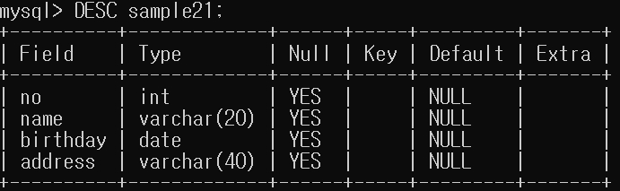

# 테이블 구조 참조하기

## DESC 명령

우리가 SELECT를 이용하여 데이터를 조회할 수 있습니다. 하지만
SELECT문은 * 사용을 제외하면 열을 지정해줘야 하기 때문에 열 정보를 알고 있어야 합니다.

이때 `DESC 명령`은 테이블에 어떤 열이 있는지 참조하도록 도와주는 명령어입니다.

``` mysql
DESC sample21; 
```



- 이를 통해 no, name, birthday, address라는 필드(열, 속성)가 있다는 걸 알 수 있습니다.
- Type은 자료형을 의미합니다.
- Null이 YES인 것은 NULL인 상태를 허용한다는 의미입니다.
- Default는 Null이라는 것은 값을 입력하지 않을 때 NULL 값이 적용된다는 의미입니다.

## 자료형

- INTEGER형
    - 정수값을 저장할 수 있는 자료형
    - 소수점은 포함될 수 없습니다.
    
- CHAR형
    - 문자열을 저장할 수 있는 자료형
    - 괄호안 숫자는 최대 입력가능한 문자열을 의미합니다.
    - 고정된 길이로 데이터를 저장합니다.
    - 최대 길이보다 적은 문자열을 입력하면 나머지에 공백문자로 채워집니다.
    
- VARCHAR형
    - 문자열을 저장할 수 있는 자료형
    - 괄호안 숫자는 최대 입력가능한 문자열을 의미합니다.
    - 데이터 크기에 맞춰 저장공간의 크기도 변합니다.
    
- DATE형
    - 날짜값(연원일의 데이터)을 저장할 수 있는 자료형
    - `2013년 3월 23일`
    
- TIME형
    - 시간(시분초의 데이터)를 저장할 수 있는 자료형
    - `12시 30분 20초`