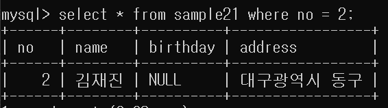
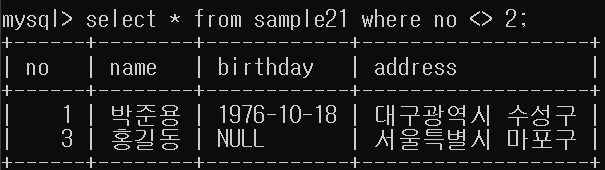
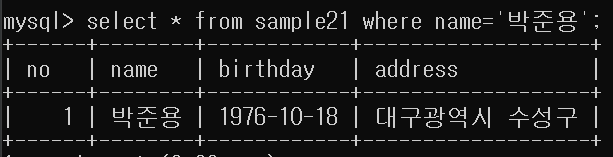
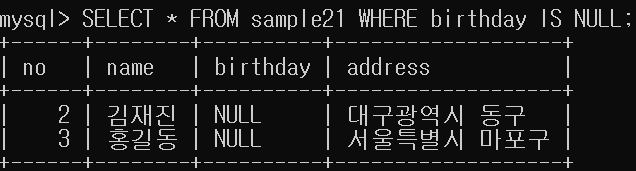

# 6강. 검색조건 지정하기

데이터 검색에는 `열을 지정하는 방법`과 `행을 지정하는 방법`이 있습니다. 

- 행을 선택할 때는 `WHERE` 구를 이용합니다.
- 열을 선택할 때는 `SELECT` 구를 사용합니다.

## 1. SELECT 구에서 열(=Field, 속성) 지정하기

- 테이블의 모든 열을 봅니다.

```mysql
SELECT * FROM 테이블명
```

- 테이블의 일부 열을 봅니다.
```mysql
SELECT 열1, 열2 FROM 테이블명
```

- 에러
    - 열을 하나도 지정하지 않을 때.
    - 테이블에 존재하지 않은 열을 지정할 때.
    
- 특징
    - 열이 정의된 순서와 동일할 필요는 없습니다.
    - 동일한 열을 중복해서 지정해도 괜찮습니다.

## 2. WHERE 구에서 행 지정하기 
- 많은 행 속에서 필요한 데이터만 검색하기 위해서 `WHERE`구를 사용합니다.
- FROM 구 뒤에 WHERE 구를 표시합니다.
- 조건식: 열과 연산자, 상수로 구성된 식을 의미합니다.
- 조건식에 일치하는 행만 SELECT의 결과로 반환됩니다.
- `=`: 비교연산자 값이 같으면 참
- `<>`: 비교연산자: 값이 다르면 참
```mysql
SELECT 열 FROM 테이블명 WHERE 조건식
```


- no : = : 2 = 열 : 연산자 : 상수




- 문자열 비교는 ''(싱글쿼트)로 둘러싸 표기합니다.
- 날짜시간형도 ''(싱글쿼트)로 표기합니다.
  - 이때 연월일은 하이픈(-)으로 구분합니다.
  - 이때 시분초는 콜론(:)으로 구분합니다.

### 구의 순서와 생략
- SQL에서 구는 순서가 정해져 있어 바꿀 수 없습니다.
- 일부 구는 WHERE처럼 생략할 수 있습니다.

### NULL값 검색하기: IS NULL 사용
- NULL 값을 검색할 때에는 '=' 연산자가 아닌 '**IS NULL**' 연산자를 사용합니다.
- 만약 반대로 NULL이 아닌 값을 검색할 때는 'IS NOT NULL' 연산자를 사용합니다.
```mysql
SELECT * FROM sample21 WHERE bitrhday IS NULL;
```



### 대표적인 비교 연산자
- `=` 
  - 좌변과 우변의 값이 같을 때 참
  
- `<>`
  - 좌변과 우변의 값이 다를 때 참
  
- `>(=)`
  - 좌변의 값이 우변의 값보다 클 때(크거나 같을 때) 참
  
- `<(=)`
  - 우변의 값이 좌변의 값보다 클 때(크거나 같을 때) 참
  
