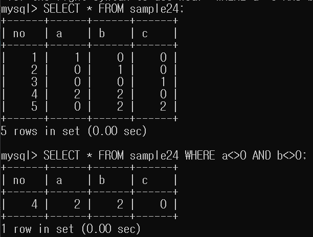
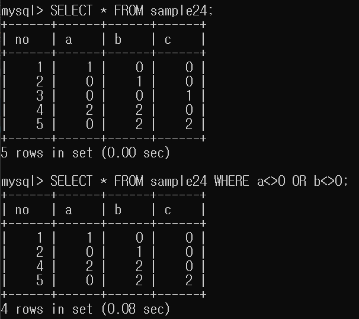
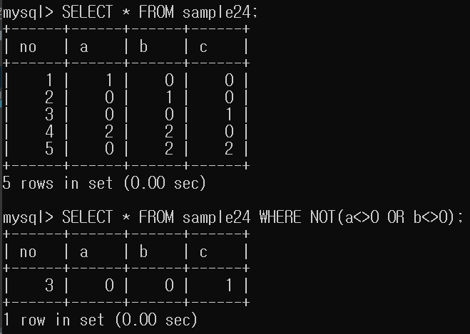

# 7강.조건조합하기

AND, OR, NOT 연산자는 좀 더 세밀하게 검색을 도와주는 논리 연산자입니다.

``` mysql
조건식1 AND 조건식2 
조건식1 OR 조건식2
NOT 조건식
```

## AND 논리 연산자
- `조건식1 AND 조건식2`
- 좌,우 식이 모두 참일 때 참
- OR 연산자보다 우선순위가 높습니다.



## OR 논리 연산자
- `조건식1 OR 조건식2`
- 좌,우 식중 적어도 하나 이상이 참일 때 참
- 일반적으로 OR 조건식은 괄호를 묶는게 안전합니다.



## NOT 논리 연산자
- 단항 연산자
- 조건식이 참이면 거짓, 거짓이면 참을 반환합니다.
- '~아닌', '~외에', '~를 제외한 나머지'

