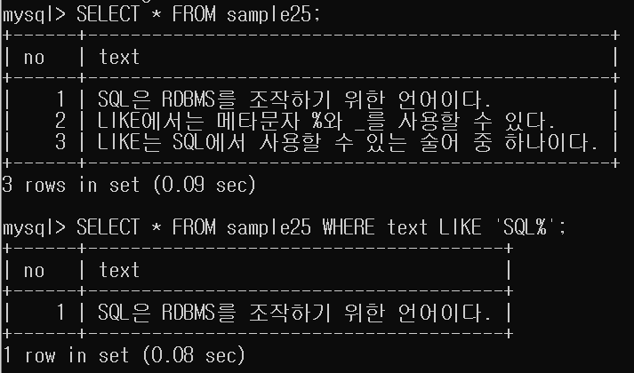
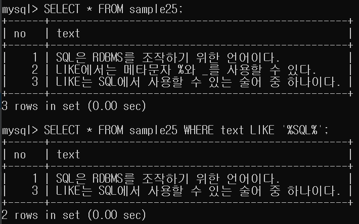
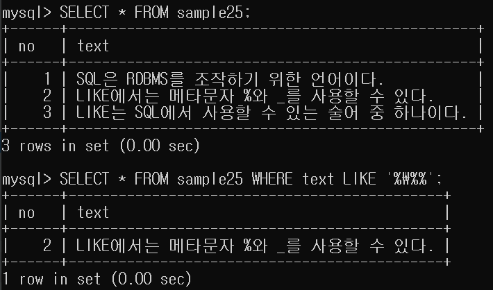

# 8강.패턴매칭으로 검색하기

```mysql
WHERE 열명 LIKE `패턴`
```
- `LIKE 술어`: 특정 문자나 문자열이 포함되어 있는지를 검색하고 싶을 때 사용합니다.
이를 `패턴 매칭`, `부분 검색`이라고 합니다.
  
- 메타문자: 패턴 매칭 시 '임의의 문자 또는 문자열'에 매치하는 부분을 지정하기 위해 쓰이는 `특수 문자`입니다.
- 사용할 수 있는 메타문자: `&`,`_`
    - &: 임의의 문자열을 의미합니다.
        - 빈 문자열과도 매치합니다.
    - _: 임의의 문자 하나를 의미합니다.
    - 메타문자는 여러개 사용 가능합니다.
    - 메타문자를 사용하지 않을 시 완전 일치만 검색됩니다.
    

- 문자열중 `SQL`로 시작하는 행을 검색합니다. 
- 전방일치


---

- 문자열 중 `SQL`이 포함된 행을 검색합니다.
- 중간일치

## 2.`%`를 검색하기


- escape 문자 `\`을 활용하여 메타문자가 아닌 일반문자 '%'를 검색할 수 있습니다.

## 3.문자열 상숭 '의 이스케이프
- `'`을 검색하고 싶을 때는 '를 연속해서 두번 기술하면 됩니다.