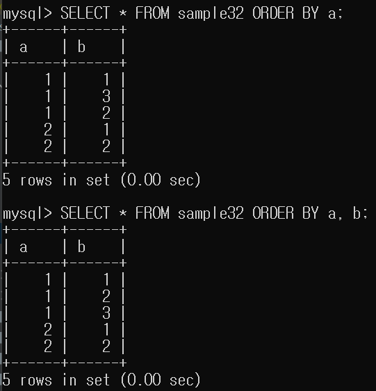
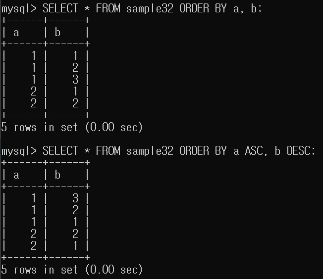

# 10강. 복수의 열을 지정해 정렬하기

## 복수 열을 지정해 정렬하는 방법
```mysql
SELECT 열명 FROM 테이블명 WHERE 조건식 ORDER BY 열명1 [ASC|DESC], 열명2 [ASC|DESC]
```

- 데이터 양이 많을 경우 하나의 열만으로는 행을 특정짓기 어렵기 때문에 사용합니다.
- ORDER BY 구를 지정해도 1개의 열만으로는 `정확한 순서`를 결정하기 어려운 상황 일 때.
- 정렬 시에는 NULL 값에 주의해야 합니다.
    - NULL 값을 가지는 행은 가장 먼저 표시되거나 가장 나중에 표시됩니다.
    - NULL에 대한 대소비교 방법은 DB 제품에 따라 다릅니다.
    - MySQL은 NULL 값을 가장 작은 값으로 취급하여 오름차순일 때 가장 먼저 표시됩니다.
- 값이 같아 순서를 결정할 수 없는 경우 다음으로 지정한 열명을 기준으로 정렬합니다.
- 앞 열부터 정렬을 시작합니다.


- a,b 모두 오름차순으로 지정합니다.

---



- a는 오름차순, b는 내림차순으로 지정하여 정렬 합니다.

---


