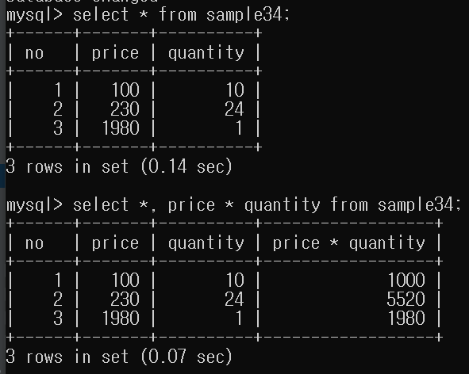
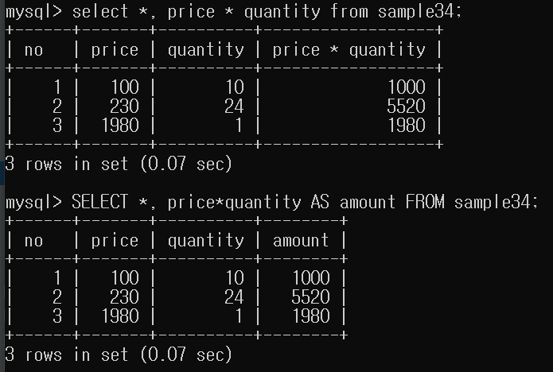
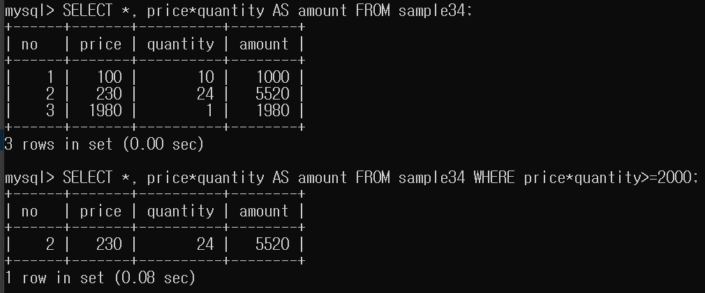
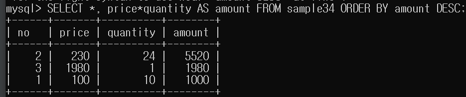
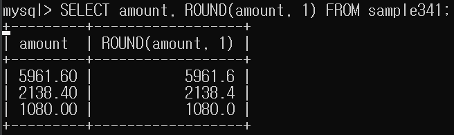
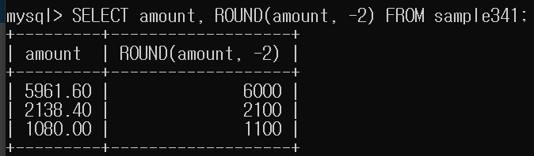

# 12강. 수치연산

# SELECT 구에서 연산

## 가격과 수량으로 금액 계산하기



## 열 이름 바꾸기



- 키워드 AS는 생략할 수 있습니다.
- 별명(alias)는 영어,한글,숫자 모두 가능하지만 한글로 지정하는 경우에는
오작동할 가능성이 있어 `백쿼트`로 둘러쌉니다.

- 이름을 지정하는 경우 숫자로 시작하지 않습니다.  
- 참고로, 문자열 상수는 싱글쿼트, db 객체명은 더블쿼트로(mysql은 싱클쿼트) 둘러쌉니다.


# WHERE 구에서 연산



- WHERE 구에서 price*quantity대신 amount로 지정하면 작동하지 않습니다.
- 서버 내부에서는 WHERE 구를 처리하고 SELECT 구를 처리합니다.
- 따라서 WHERE 구 분석할 시 에러가 발생합니다.

## NULL
- NULL로 연산하면 결과는 NULL이 됩니다.
- NULL + 1 = NULL

## ORDER BY 구에서 연산
- ODDER BY 구에서도 연산이 가능합니다.
- SELECT 구에서 별명을 만들었기에 ORDER BY 구에서 별명을 사용할 수 있습니다.
- WHERE -->  SELECT --> ORDER BY




## 함수
```mysql
함수명(인수1, 인수2...)
```

- 10 % 3 -->1
- MOD(10, 3) -->1

### ROUND(열명, 표현할 소수점자리) 함수



- 반올림 해주는 함수
- 두 번째 인수를 생략하면 소수점 첫째 짜리를 반올림 합니다.
- 2번째 인수를 음수로 지정하면 정수부의 반올림할 자릿수도 지정할 수 있습니다.

