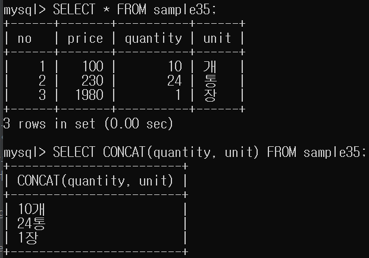

# 13강.문자열 연산

## 문자열 결합
- `문자열 결합`: 문자열 데이터를 결합하는 연산
- 연산기호: +(SQL Server), ||(Oracle, DB2, PostgreSQL), CONCAT(MySQL)
- 2개의 열 데이터를 모아서 1개의 열로 처리하고 싶은 경우에 자주 사용합니다.



- 문자열 + INTEGER형 --> 문자열형

## SUBSTRING 함수

- 문자열의 일부분을 계산해서 반환해주는 함수.
```mysql
SUBSTRING('20140125001', 1, 4) --> '2014'

SUBSTRING('20140125001', 5, 2) --> '01'
```


## Trim()
- 문자열의 앞뒤로 여분의 스페이스가 있을 경우 이를 제거해주는 함수.
- 문자열 도중에 존재하는 스페이스는 제거되지 않습니다.
```mysql
TRIM('ABC  ') --> 'ABC'
```

## CHARACTER_LENGTH()
- 문자열의 길이를 계산해 돌려주는 함수
- CHAR_LENGTH으로 줄여서 사용할 수 있습니다.


## OCTET_LENGTH()
- 문자열의 길이를 바이트 단위로 계산해 돌려주는 함수.


# 문자세트(character set)
- 데이터 단위로 `바이트`라는 것이 있습니다.
- 문자 하나의 데이터가 몇 바이트의 저장공간을 필요로 하는지 `인코드 방식`에 따라 결정됩니다.
- 문자를 수치화(`인코드`) 하는 방식에 따라 필요한 저장 공간의 크기가 달라집니다.
- 핵심: **한 문자가 몇 바이트인지는 쓰이는 문자세트에 따라 다르다.**
- CHAR_LENGTH를 사용할 때는 상관 없지만, OCTET_LENGTH를 이용할 경우 바이트 단위로 길이를 계산하므로 주의해야합니다.
- 반각: 영어, 숫자
- 전각: 한글, 중국어, 일본어


