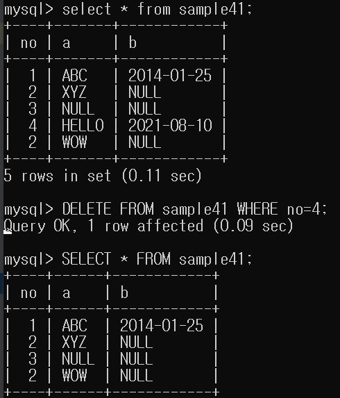

# 17강 데이터 삭제하기

- 테이블의 행 데이터를 삭제하기 위해서는 `DELETE` 명령어를 사용합니다.
- DELETE 명령 사용 전에 SELECT 명령어를 이용하여 어떤 데이터가 들어있는지 확인합니다.
- WHERE 조건식을 생략하면 테이블 모든 데이터가 삭제됩니다.

```mysql
DELETE FROM 테이블명 WHERE 조건식
```

---


- no이 4인 행 데이터를 삭제합니다.

