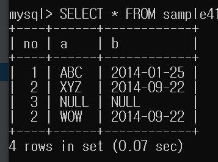

# 18강 데이터 갱신하기, UPDATE

```mysql
UPDATE 테이블명 SET 열1=값1, 열2=값2, ... WHERE 조건식 
```

- UPDATE 명령어는 시스템을 관리할 때 자주 사용합니다.
- '등록'이나 '갱신' 버튼을 클릭하면 UPDATE 명령어가 실행됩니다.
- 셀 단위로 데이터를 갱신 할 수 있습니다.
- WHERE 구를 생략하면 테이블 모든 행을 갱신합니다.
- SET 구를 이용하여 갱신할 열과 값을 결정합니다.  

### 1. 데이터를 갱신하기 전에 어떤 데이터가 저장되어있는지 확인합니다.


### 2. UPDATE 문을 사용하여 데이터를 갱신합니다.


### 3. 데이터가 업데이트 되었는지 확인합니다.



---
- MySQL의 경우 SET의 처리 순서를 고려할 필요성이 있다.