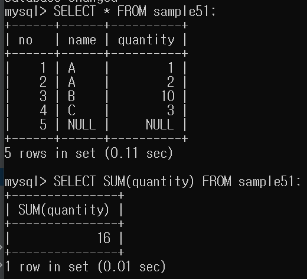
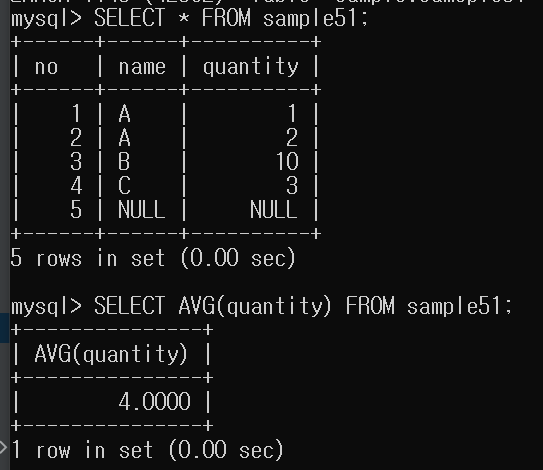
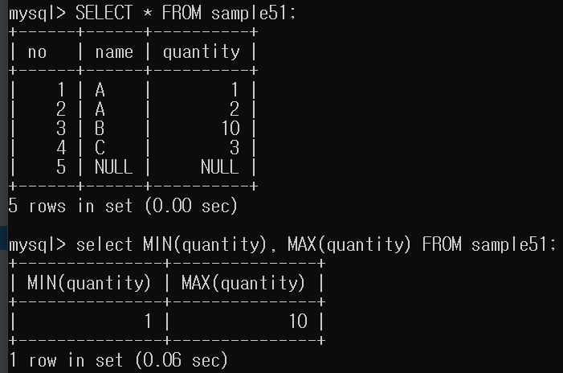

# SUM()으로 합 구하기

```mysql
SELECT SUM(열명) FROM 테이블명
```

- 지정되는 집합은 수치형만 가능하다.
- 문자열, 날짜시간형은 안된다.
- NULL 값은 무시한다.



# AVG()로 평균 구하기

```mysql
SELECT AVG(열명) FROM 테이블명
```

- 수치형만 가능하다.
- 문자열, 날짜시간형은 안 된다.
- NULL 값은 무시한다.
- NULL을 0으로 간주해서 평균을 내고 싶으면 CASE를 이용하여
NULL을 0으로 변환한 뒤 AVG를 계산한다.
    - SELECT AVG(CASE WHEN quantity IS NULL THEN 0 ELSE quantity END) AS avgnull0 FROM sample51;




# MIN(), MAX()로 최솟값 최댓값 구하기

```mysql
SELECT MIN(열명), MAX(열명) FROM 테이블명
```

- 문자열형과 날짜시간형에도 사용할 수 있다.
- NULL값은 무시한다.

