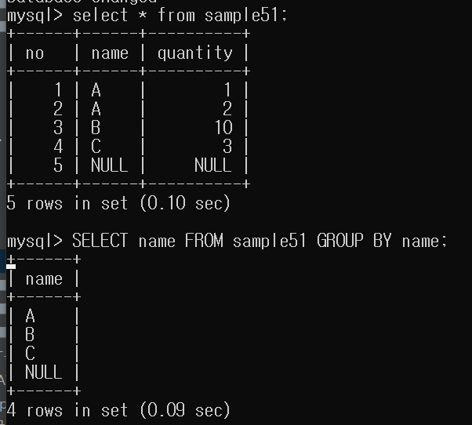
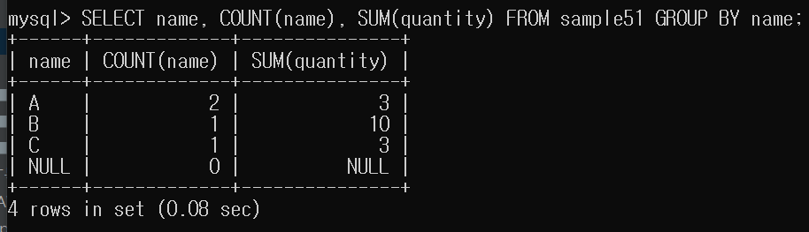

# GROUP BY(그룹화)

- 집계함수로 넘겨줄 집합을 그룹으로 나누기
- 이를통해 집계함수를 더 활용할 수 있다.
- 점포별, 상품별, 월별, 일별 등 특정 단위로 집계할 때 사용된다.
    - SUM 집계함수를 이용 : 매출실적
    - COUNT 집계함수 이용 : 건수

---

- GROUPBY로 name열 그룹화하기
- 중복이 제거되는 효과가 생김.

---

## GROUPBY는 집계함수와 같이 사용할 때 의미가 있다.

- name을 그룹화 한다.
- 각각의 그룹화된 name을 기준으로 name 갯수와 quantity의 합을 구한다.

