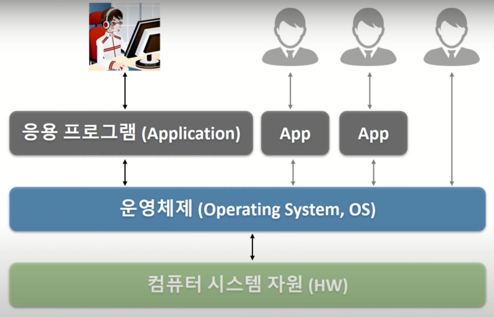
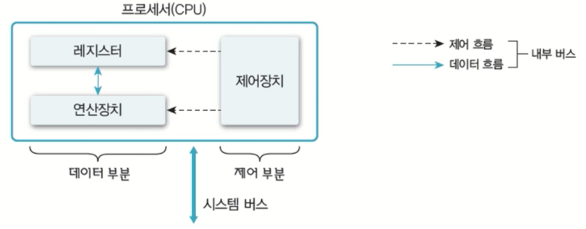
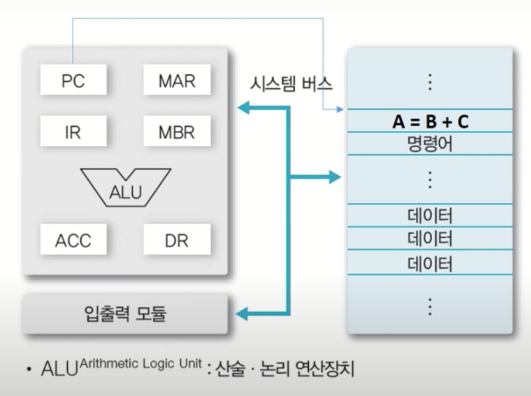
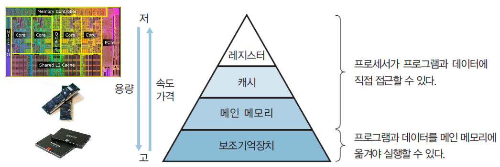

# 컴퓨터 시스템 개요(Computer System overview)

## 컴퓨터 하드웨어(Computer Hardware)
- 컴퓨터 안을 살펴보면 여러가지 하드웨어로 이루어져 있습니다. 
- `운영체제(Operating System, OS)`: 하드웨어(HW)들을 **효율적으로 관리**하여 사용자 또는 응용프로그램에게
**서비스를 제공**하는 역할을 하는 **시스템 소프트웨어**합니다.
  

그러면 운영체제가 관리하는 하드웨어에는 어떤 것들이 있는지 살펴볼까요?
컴퓨터 하드웨어는 아래와 같이 크게 3가지로 나눌 수 있습니다.

### 1.프로세서(Processor): 계산하고 제어하는 장치
- 가장 대표적으로 CPU
- 그래픽카드(GPU)
    - 과거: 그래픽을 위한 연산만
    - 현재: 그래픽 외에도 다양한 연산을 위해 많이 사용(=gpgpu)
- 응용 전용 처리장치 등

### 2. 메모리(Memory): 무언가 저장하는 장치
- 주 기억장치
    - DRAM(Dynamic Random Access Memory)
- 보조 기억장치
    - Disk

### 3. 주변장치
- 키보드/마우스: 입력장치
- 모니터, 프린터: 출력장치
- 네트워크 모뎀 : 네트워크 장치

## 1.프로세서(Processor)
- `프로세서(Processor)`: 무엇가를 계산하고 컴퓨터의 동작을 제어하는 장치입니다.
    - **연산** 기능을 수행합니다.
    - 컴퓨터의 모든 장치의 동작을 **제어**합니다.
    - 대표적으로 CPU가 있습니다.
    

## 1.1 레지스터(Register): 메모리의 일종
- `레지스터`: CPU가 요청을 처리하는 데 필요한 데이터를 일시적으로 저장하는 메모리(=기억장치).
    - 메모리 중에서 **가장 빠른** 메모리입니다.
    - CPU `내부`에 있는 메모리(참고로 캐시도 CPU내부에 있는 메모리이지만 레지스터가 더 코어부분에 가까이 있습니다.) 
    
- 레지스터의 종류 
    - **용도**에 따라 
        - `전용 레지스터`와 `범용 레지스터`로 나눠집니다.
    
    - 사용자가 정보를 **바꿀 수** 있는지에 따라
        - `가시 레지스터`와 `불가시 레지스터`로 구분됩니다.
    
    - 저장하는 정보의 **종류**에 따라
        - `데이터 레지스터`, `주소 레지스터`, `상태 레지스터`로 구분됩니다.
    
### 사용자 가시 레지스터: 사용자가 볼 수 있는 레지스터
- 데이터 레지스터(DR, Data Register): 데이터를 저장하는 레지스터.
- 주소 레지스터(AR, Address Register): 주소를 저장하는 레지스터.

### 사용자 불가시 레지스터: 사용자가 볼 수 없는 레지스터
- 일반적으로 전용 레지스터가 불가시 레지스터에 속합니다.
- 프로그램 카운터(PC, Program Counter): 다음에 실행할 명령어의 주소를 보관하는 레지스터
- 명령어 레지스터(IR, Instruction Register): 현재 실행하는 명령어를 보관하는 레지스터
- 누산기(ACC, AACumulator): 데이터를 일시적으로 저장하는 레지스터
    - 계산하는 과정에서 저장이 필요한 데이터를 일시적으로 저장합니다.

### 프로세서 동작 방식

- ALU: 계산하는 연산 장치(PC, MAR, IR ...)

### 운영체제와 프로세서 관계
- 운영체제가 하는 역할 중 하나는 프로세스를 관리하는 것입니다.
    - OS는 CPU에게 처리할 작업을 할당하고 관리합니다.
         - 프로세스(Process=프로그램) 생성 및 관리.
      - 3장
    
- os는 프로그램이 cpu를 사용하는 시간 제어합니다.
- os는 여러 프로그램이 하나의 cpu를 사용할 때 시간을 조율합니다.
    - 4장~5장

## 2. 메모리(Memory)
- `메모리(=기억장치)`: 데이터를 저장하는 장치입니다.
    - 프로그램(os, 응용프로그램 등)을 저장할 수 있고, 데이터를 저장할 수도 있습니다.
    
- 메모리의 종류: 1.레지스터 2.캐시 3.메인메모리 4.보조기억장치
    - 메모리는 왜 종류가 나뉘어져 있나요?
    - 답변: 자원이 무한이 있다면 당연히 모든 메모리를 레지스터로 만들면
    되겠지만 자원은 한정되어있고 공학자는 한정된 자원으로 최고의 성능을 내야하기 때문입니다.

## 2.1 메모리 종류(크게 4가지)

### 2.1.1 주기억장치(=메인메모리, Main memory, RAM)

- `메인메모리`: CPU가 수행할 프로그램과 데이터를 저장합니다.
  
- 프로그램을 실행하거나 데이터를 사용할 때 반드시 메인메모리에 들어가 있어야합니다.
 
> 질문자: 왜요??

> 답변자: 프로세서(CPU)는 주기억장치(RAM)까지의 메모리만 `직접` 접근할 수 있기 때문입니다. 
    
> 질문자: 그런데 왜 Disk에 있는 데이터를 안 가져다 쓰고 굳이 메인 메모리(ram)을 거쳐 
> 데이터를 가져오나요?

> 기술이 진보함에따라 Disk와 CPU의 성능 차이가 많이 나게 됩니다. 
> 즉, cpu는 빠르지만 메모리가 따라가지 못하는 문제(=I/0 병목현상)가 발생하게 됩니다. 
> 그래서 해결 방법으로 disk보다는 작지만 빠른 메모리를 생각하게됩니다.
> cpu가 일을하는 동안 다음에 필요한 데이터를 이 메모리(ram)에 넣자는 생각을 하게 됩니다. 
> 그 결과 메인 메모리가 생기게 되고 메인 메모리를 거치게 되었습니다.

- 주로 DRAM(=동적 램)을 사용합니다.
    - 동적램은 용량이 크고 가격이 저렴합니다.
    
- DRAM은 메인보드에 꽂혀있습니다.
    - 요즘은 DDR4를 많이 사용합니다.
    
- **디스크 입출력 병목현상(I/O bootleneck)이 해소됩니다.**

### 캐시(Cache)
- `캐시`: CPU(=프로세서) 안에 있는 메모리입니다.(L1, L2 캐시 등)
    - 속도가 빠르고, 가격이 비쌉니다.
    
- **메인 메모리의 입출력 병목현상을 해소합니다.**

> 레지스터와 캐시의 차이는 무엇인가요?
> 레지스터는 Core에 훨씬 더 가까이 있고 더 빠른 메모리입니다.
> 캐시는 레지스터보다 Core에 멀리 떨어져 있고 상대적으로 더 느립니다.

> 캐시는 왜 있어야 되나요?

> 위의 상황과 비슷한 상황입니다. 메인 메모리로 cpu와 disk의 갭을 줄였지만
> 여전히 cpu와 메인메모리 사이에 큰 갭(=메인메모리 입출력 병목현상)이 존재하게 됩니다.
> 그래서 똑같은 방식으로 사이에 더 작고 빠른 메모리(=캐시)를 만들어 해결합니다.

## 2.1.2 캐시의 동작

- 일반적으로 CPU가 자동으로 관리합니다. 
  
- 메인메모리에서 1개의 데이터만 가져오는게 아니라 주변 데이터까지 캐시로
가져옵니다. 그리고 이 크기를 `캐시 라인(cache line) 또는 캐시 블록(cache block)`크기라 합니다.
> CPU가 캐시를 어떻게 관리하나요?

> CPU가 일을하면서 데이터가 필요할 때 캐시가 없다면 바로 메인 메모리에서
> 데이터를 읽게됩니다. 하지만 캐시가 있다면 (1)먼저 캐시에게 데이터가 있는지 물어보고
> 만약에 없다면 (2)캐시가 메인 메모리에 가서 캐시 안으로 데이터를 가지고 옵니다.
> (3) 그 다음에 가져온 데이터를 프로세서(CPU)에게 전달합니다. 

- 캐시 히트(Cache hit): 필요한 데이터 블록이 캐시로 존재하는 경우를 말합니다.
  > = CPU가 캐시에게 필요한 데이터가 있는지 물어봤는데 캐시가 있다고 대답한 상황
- 캐시 미스(Cache miss): 필요한 데이터 블록이 없는 경우를 말합니다.
  > 위와 반대로, CPU가 캐시에게 필요한 데이터가 있는지 물어봤는데 캐시가 없다고 대답한 상황.
  > 캐시가 메인메모리에서 데이터를 가져와야됩니다.

>의문: 과연 캐시가 128KB밖에 없는데 효과가 있을까?

> 정답: 있다! 바로 `지역성`때문에!!

### 지역성(Locality): 크게 2가지가 존재합니다.
- `공간적 지역성(Spatial locality)`: 참조한 주소와
인접한 주소를 참조하는 특성(=어떤 주소를 참조하면 다음 번에 그 주소 근처를 참조할
  가능성이 높다는 특성을 말합니다.)
    - 예를들어 순차적 프로그램 수행이 있습니다.
    - 
    
- `시간적 지역성(Temporal locality)`: 한 번 참조한 주소를 곧 다시
참조하는 특성
    - 예를들어, For 문등의 순환 문
    
- `지역성은 캐시 적중률(cache hit ratio)`와 관련이 높습니다.
    - 알고리즘 성능 향상을 위한 중요한 요소 중 하 나 입니다.
  - 이러한 지역성으로 인해 캐시가 히트할 가능성이 높아집니다.
    
# 메모리의 종류

## 2.1.3 보조기억 장치(HDD, Auxiliary memory, storage, secondary memory)
- `보조기억 장치(=스토리지)`: 프로그램과 데이터를 저장하는 메모리입니다.
- 프로세서가 직접 접근할 수 없어 주변 장치라고 불립니다.
    - 따라서 메인메모리(=램)에 올려놓고 사용합니다. 
    - (프로그램/데이터 > 주기억장치)인 경우에는 가상메모리를(Virtual memory)를
    사용합니다.
        - 예를들어 램이 8기가이고 실행하려는 프로그램이 20기가일 경우 
        - 가상메모리: 하드디스크의 일부를 메인메모리처럼 사용합니다.
      
- 용량이 크고, 가격이 저렴합니다.

### 메모리와 운영체제
- 메모리 할당 및 관리 
    - 프로그램의 요청에 따른 메모리 할당 및 회수
    - 할당된 메모리 관리
    
    
- 가상 메모리 관리
    - 가상메모리 생성 및 관리
    - 논리주소 --> 물리주소 변환
    
## 시스템 버스(System Bus)
- `시스템 버스`: 하드웨어들이 데이터 및 신호를 주고 받는 **물리적인 통로**

1. 데이터 버스: 데이터가 타는 버스
2. 주소 버스: 주소가 타는 버스
3. 제어 버스: 제어 신호가 타는 버스

## 3. 주변 장치
- `주변장치`: 프로세서와 메모리를 제외한 하드웨어들을 의마한다.
    - 입력장치: 마우스,키보드, 터치인터페이스
    - 출력장치: 모니터, 프린터, 스피커
    - 저장장치: 하드디스크, CD
    
### 3.1 주변장치와 운영체제
- 장치드라이버 관리: 주변 장치 사용을 위해서 인터페이스를 제공합니다.
- 인터럽트(Interrupt)처리: 입력을 할 때 시스템에게 알려주는 것.
    - 주변 장치의 요청 처리.
  
- 파일 및 디스크 관리
    - 파일을 생성하고 삭제합니다.
    - 디스크 공간 관리 등
    
