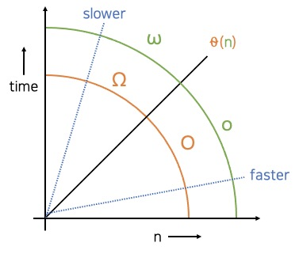

# 빅오표기법(Big O Notation)

## 🤔 생각해봅시다
- 알고리즘 효율성은 **어떻게 비교**할까요? 수학적으로 효율성을 표시하는 **빅오 표기법**을 배워봅시다!

## 🎯 목표
- 빅 오 표기법을 이해하고 다른 사람에게 설명할 수 있습니다.

## 🔑 핵심 키워드
- 알고리즘 비교
- 빅 오 표기법

---
### 빅 오 표기법
- 빅 오 표기법: 알고리즘의 효율성을 표시하는 표기법
- 빅오표기법을 이용하면 다른 알고리즘과 효율성을 비교할 수 있습니다.

  
- x축: 복잡도 n, 일의 양
- y축: 시간, 필요한 일의 양, 메모리의 양. 값이 커질 수록 오래 걸리고 값이 작으면 빠릅니다.
- faster 함수의 해석은 n이 증가할 때 n 함수보다 더 작은 작업을 필요로 한다는 의미입니다.
즉 같은 일을 하는데 더 적은 시간이 사용됩니다. 따라서 더 빠른 알고리즘입니다. 
  
- 좋은 알고리즘 = 더 빠른 알고리즘 

### 빅오표기법에서 알고리즘 간의 관계
- O(빅오 복잡도): same or faster
- 0(세타 복잡도): same 
- 빅 오메가 복잡도: same or slower
- 리틀 오 복잡도: 빠르지만 같지 않다
- 리틀 오메가 복잡도: 느리지만 같지 않다. 
