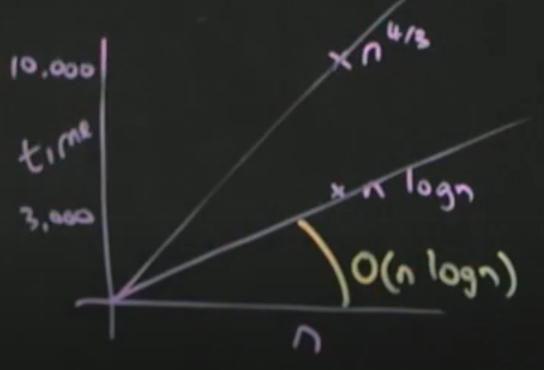
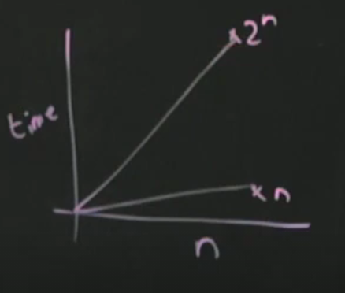

# 생각해봅시다
- 빅오표기법을 이용하여 알고리즘의 효율성을 비교해봅시다.

## 목표
-   빅오표기법을 제대로 사용하여 알고리즘 효율성을 비교할 수 있다.

## 키워드
- 알고리즘 비교
- 빅오표기법

---

### 빅오표기법 예시
아래의 식이 옳은지 판별해보세요

- n^4/3 = O(nlogn)(n^4/3 함수는 O(nlogn) 복잡도에 속할까??)
    - 우리는 n이 작을 때는 관심이 없습니다. n이 무한히 커질 때 관심이 있습니다. 쉬운 방법은 큰 수를 대입하는 것 입니다.
    - 1000^4/3 = O(1000*log1000)
    - 10000 = O(1000*3) 
    - 선의 모양은 상관 없습니다.
    - 
    - F: n^4/3은 nlogn보다 위에 있으므로 O(nlogn)에 속하지 않습니다.
    - 이 방법이 통하지 않는 식도 있습니다(5%이내). 엄밀하게 이런 문제를 풀기 위해서는 로피탈법칙을 이용해야 합니다.

- 3n^3 + 4n^2 + 5n + 6 = θ(n^3)
  - n^3 = θ(n^3): 낮은 차수, 상수항은 무시합니다.
  - T

- n(n-1)/2 = O(n^2)
  - n^2 = O(n^2)
  - T

- 2^n = w(n)
  - 2^1000 = w(1000)
  - 

- n^3 = O(n^2)
  - F

- n^2 = O(n^3)
  - T