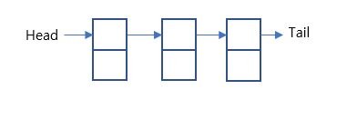
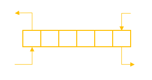
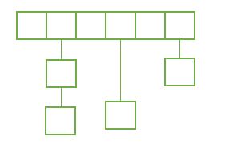
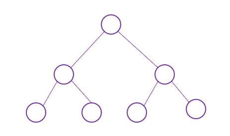

## 자료구조 입문하기

### 🤔 생각해봅시다
- 많은 양의 데이터를 관리하는 방법은 무엇이 있을까요?
- 사용자가 만드는 복잡한 명령어를 컴퓨터는 어떻게 효율적으로 처리 할까요?
- 이러한 의문들을 자료구조를 배움으로써 해결할 수 있습니다.

### 🎯 목표
- 자료구조의 종류와 정의를 설명할 수 있습니다.

### 🔑 핵심 키워드
- 연결리스트
- 스택, 큐
- 해시
- 트리
- 정렬

### 연결리스트

### 스택 & 큐

### 해시

### 트리

### 정렬

