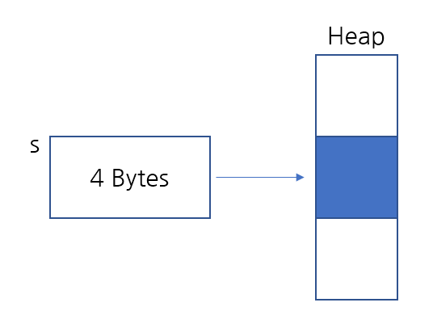
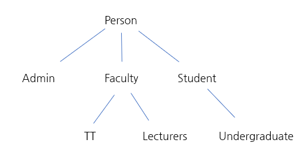

# 객체지향프로그래밍(Object Oriented Programming)

`int i = 10;`
- 여기에 메모리가 얼마나 사용됬을까??: 4bytes
   - 자바는 int에 4바이트를 필요로 합니다. 
  - long의 경우 8바이트를 필요로 합니다.
  
`Student s = new Student();`
- 객체를 생성하는데 메모리가 얼마나 들었을까??
- 객체의 종류에 따라 달라집니다. 


## 객체 메모리 할당법
- 키워드 **new**를 사용하여 객체(인스턴스) student를 만들면
**JVM**(자바가상머신)은 코드를 읽고 메모리가 얼마나 필요한지 계산하고
  그만큼의 공간을 **Heap에 할당(allocate)**합니다. 그리고 Heap에 있는 공간을 가리키는
  4바이트짜리 포인터를 하나 만듭니다.
  
- JVM은 객체가 무엇이고 어디서 왔는지 알아야합니다. 그래야 적당한 공간을 할당할 수 있습니다.
이를 위해서는 상속이 필요합니다. 
  
``` JAVA
Student s = new Student();
```


## 상속(Inheritance)
여러 개의 객체가 있으면 상속을 활용하여 **객체 간의 관계**를 나타낼 수 있습니다.
People, Student, Undergraduate 클래스를 만들어 봅시다.
  
- Person: 대학에 있는 여러 사람입니다. 변수는 redid(빨간색 ID 카드), name, email입니다.
- Student: 대학생들입니다. 변수는 GPA,지금까지 들은 수업입니다.
- Undergraduate: 학부생들입니다. 변수는 year입니다.

이렇게 3개의 클래스를 구성하면, **학생이 사람에 속하게되고 학부생이 학생에 속하게 되면
학부생도 사람에 속하게 됩니다.** 이러한 관계를 나타내기 위해 상속을 사용합니다.
클래스를 정의 할 때, 아래와 같이 **extends**를 적어주면 됩니다.


``` java
public class Person{
  int redid;
  String name;
  String email;
}

// JVM이 extends Person을 보는순간 
// JVM은 Person을 상속하는 걸 알아채고 
// Person 클래스의 변수와 메소드를 모두 가져옵니다.
public class Student extends Person{
  float gpa;

}

//  undergraduate 클래스가 Person 클래스를 상속할 필요는
// 없습니다. 왜냐하면 Student 클래스가 Person을 상속하고 
// 있기 때문입니다. 또한 각각의 클래스는 하나의 클래스만
// 상속할 수 있기 때문입니다. 
public class Undergraduate extends Student{
  int year;

}
```


이제 Student 클래스를 만들면 JMV(자바가상머신)은 이 클래스가 Person을 상속한다는 것을 알아채고
Person 클래스에 있는 변수와 메소드를 모두 가져옵니다.
마찬가지로 Undergradutate 클래스를 만들면 Student 클래스에 있는 변수와 메소드를 모두 가져옵니다.

### 상속 특징1
- **JAVA**에서 **각각의 클래스는 하나의 클래스만 상속**받을 수 있습니다.

어떤 프로그래밍 언어에서는 여러 클래스를 상속받을 수 있는데, 이를 다중 상속이라고 합니다. 
하지만 이럴 경우, 만약 상속받은 다른 클래스에도 같은 redid 변수가 있다면 두 개의 다른 클래스를
상속받았을 때 둘 중 어느 클래스의 멤버 변수를 의미하는 것인지 알 방법이 없습니다.
이런 문제를 방지하기 위해, JAVA와 여러 다른 프로그래밍 언어에서는 다중 상속을 허용하지 않습니다.


### 상속 특징2


- **오직 상속받는 클래스의 정보만** 갖고 있습니다.

이러한 대학의 계층 구조를 위와 같이 그려볼 수 있습니다. 
이 구조에서 학부생은 교직원이나 관리 직원들에 대한 정보는 가지고 있지 않습니다.
즉, **자기 클래스에서 트리를 올라갈 수만 있고 내려갈 수 없습니다.**
 

### 상속 특징3
- **상속받는 클래스의 공간**을 함께 할당합니다.

``` java
// u에는 4바이트가 할당됩니다. 그리고 포인트 u가 가리키는 
// 힙에는 Undergraduate에 맞는 공간이 할당됩니다.
// 즉, 힙에는 year과 상속받은 변수 메소드가 들어있습니다.  
Undergraduate u = new Undergraduate();
```

상속을 받은 상태로, 새로운 객체 Undergraduate u를 정의하면,
**u에는 4바이트가 할당**됩니다. 그리고 이 포인터가 가리키는 힙에는
**Undergraduate에 맞는 공간이 할당**됩니다. Undergraduate에 있는 year, **Student** 클래스에 들어 있는 모든 변수,
**Person** 클래스에 들어있는 redid, name, email 등의 변수도 힙에 들어갑니다.

```java
// 사실 이렇게 코드를 작성하는 경우는 거의 없습니다. 
// 하지만 아주 가끔 이렇게 작성해야되는 경우도 있습니다.
// Heap에는 위에 경우와 같이 Person, Student, Undergraduate
// 클래스의 모든 변수와 메소드가 들어있습니다.
// 하지만 참조변수 s는 학부생과 관련된 메소드를 사용할 수 없습니다.
// 즉 모든 정보를 담은 Heap 공간은 있지만 s가 학부생과 관련된 정보에 접근할 수 없는 것입니다.
Student s = new Undergraduate(); 
```

위와같이, s라는 이름의 Student를 만들 수도 있습니다. 이렇게 코드를 적으면 **Undergraduate 객체에 필요한 만큼
공간**을 할당받고 Person의 변수, Student의 변수, Undergraduate의 변수를 모두 알 수 있습니다. 따라서
,**Student 클래스의 변수를 파악**하고 메모리를 계산할 수 있습니다.

```java
// 이것은 불가능 합니다.
Undergraduate u = new Student();
```

하지만 **반대로 할 수는 없습니다.** 이런 코드를 쓰게 되면 **힙에 할당되는 공간은 Student에 해당하는 만큼**
입니다. 하지만 이렇게 되면 Student에 포함된 내용과 Person에 포함된 내용만 알 수 있습니다. **Undergraduate 클래스의 내용은
접근할 수 없**기 때문에, 이 코드는 컴파일되지 않습니다.