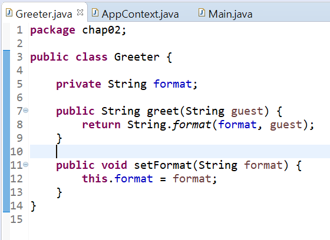
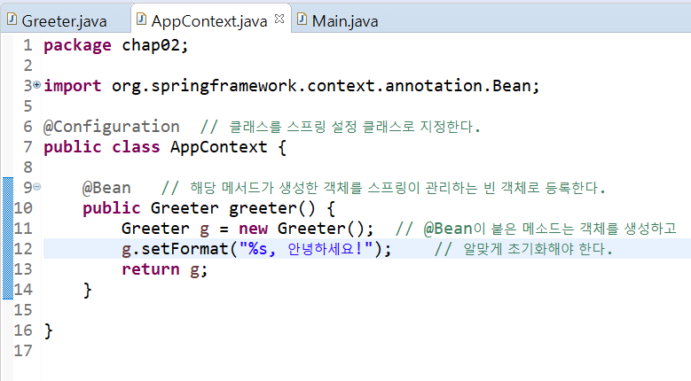

# 챕터2 스프링시작하기

## 스프링을 이용하는 자바 프로젝트 진행 순서

1. 메이븐/그레이들 프로젝트 생성
2. 이클립스/인텔리제이에서 생성한 프로젝트 임포트
3. 스프링에 맞는 자바 코드와 설정 파일 작성
4. 실행

### pom.mxl

- 메이븐 루트 프로젝트에 위치한다.
- 프로젝트에 대한 설정 정보를 관리하는 파일
- 의존 모듈이나 플로그인 등에 관한 정보를 관리

- 한 개의 모듈을 아티팩트라는 단위로 관리
- 의존을 추가한다 = 클래스패스에 해당 모듈을 추가한다.
- 각 아티팩트의 이름 = 아티팩트이름-버전.jar
    - ex) spring-context-5.0.2.RELEASE.jar
    
- 메이븐 프로젝트는 컴파일하거나 실행할 때 아티팩트 파일을 사용한다.
- 라이브러리는 다음 과정을 통해 구한다
    1. 로컬 레포지토리에서 [그룹ID]\\[아티팩트ID]\\[버전]폴더에
    아티팩트ID-버전.jar 형식의 이름을 갖는 파일이 있는지 확인한다.
       
    2. 만약 로컬 레포지토리에 파일이 없다면 원격 중앙 레포지토리에서
    해당 파일을 로컬 레포지토리에 다운로드 한 뒤 그 파일을 사용한다.
       
- 기본적으로 사용자이름\\.m2\\repository 폴더를 로컬 레포지토리로 사용한다.
- 실제 라이브러리 파일은 위의 위치에서 [그룹ID]\\[아티팩트ID]\\[버전]폴더에
 있다.
  
    - ex) groupId:org.springframework
    - artifactId:spring-context
    - version: 5.0.2.RELEASE
    - 라이브러리 위치:[사용자홈폴더]\\.m2\\repository\\org\\springframework\\spring-context\\5.0.2.RELEASE
    
- 라이브러리를 다운로드하면 그 라이브러리가 의존하는 다른 라이브러리도 다운로드 된다.
이것을 의존 전이(Transitive Dependencies)라 한다.
  
- 그레이들 프로젝트와 폴더 구조가 같다.

## 스프링을 이용한 프로그램 작성하기

- Greeter.java: 콘솔에 간단한 메세지를 출력하는 자바 클래스
- AppContext.java: 스프링 설정 파일
- Main.java: main() 메소드를 통해 스프링과 Greeter를 실행하는 자바 클래스

- @Configuration
    - 클래스를 스프링 설정 클래스로 지정한다
    
- 스프링은 객체를 생성하고 초기화하는 기능을 제공한다
- 스프링이 생성하는 객체를 빈(Bean) 객체라고 한다.

- @Bean
    - 해당 메서드가 생성한 객체를 스프링이 관리하는 빈 객체로 등록한다.
    - 해당 메소드의 이름은 빈 객체를 구분할 때 사용된다.
    - 해당 메소드는 객체를 생성하고 알맞게 초기화 해야한다.
    
## 스프링 = 객체 컨테이너

- BeanFactory 인터페이스
    - 객체 생성과 검색에 대한 기능 정의
    - getBean() 메소드가 여기에 정의되어 있다.
        - 빈 객체를 반환한다.

- ApplicationContext 인터페이스
    - 객체를 생성하고 초기화하는 기능
    
- AnnotationConfigApplicationContext 클래스
    - 위의 인터페이스를 구현한 클래스 중 하나.
    - 애노테이션을 이용해서 자바 클래스에서 정보를 읽어, 객체를 생성하고 초기화를 수행한다.
    
- BeanFactory와 ApplicationContext는 빈 객체의 생성, 초기화, 보관, 제거 등을
관리하기 때문에 (스프링) 컨테이너라고도 불린다.
  
- 기본적으로 스프링은 한 개의 빈 객체만을 생성하고 이러한 객체는 싱글톤 범위를
갖는다고 표현한다.
  
- 기본적으로 스프링은 1개의 @Bean에 대해 한 개의 빈 객체를 생성한다.
  
- 싱글톤 = 단일 객체
