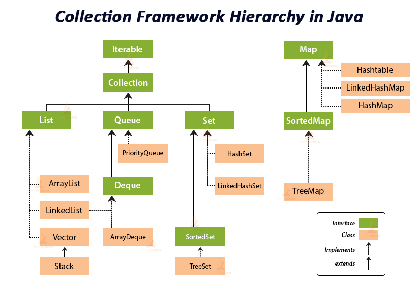

# Collection Framework1

- `프레임워크(Framework)`
    - 자바에서는 `잘 정의된 클래스들의 모임`
    
- 자료구조에서 대표적인 데이터 저장 방식
  - 리스트
  - 스택
  - 큐
  - 트리
  - 해시

- `컬렉션` 프레임워크:
    - 데이터의 저장 방법(자료구조), 데이터 저장 방법과 관련된 알고리즘에 대한 프레임워크.
    - 자료구조와 알고리즘을 제네릭 기반의 클래스와 메소드로 미리 구현해 놓은 결과물.
  
## 컬렉션 프레임워크의 기본 구조

---

컬렉션 프레임워크 구조는 인터페이스의 상속 관계로 구성됩니다. 그리고 모든 인터페이스는 제네릭으로
정의되어있습니다. 이러한 인터페이스를 구현한 클래스를 `컬렉션 클래스`라고 합니다. 컬렉션 클래스와 인터페이스는는 대부분
java.util 패키지에 묶여 있습니다. 컬렉션 클래스를 기반으로 생성되는 `컬렉션 인스턴스`
는 인스턴스의 저장을 목적으로 합니다.


    

---

### List<E> 인터페이스를 구현한 컬렉션 클래스

List 인터페이스를 구현한 대표적인 컬렉션 클래스는
ArrayList와 LinkedList가 있습니다.

- ArrayList\<E>: 배열을 이용한 인스턴스 저장.
- LinkedList\<E>: 리스트를 이용한 인스턴스 저장.

List 인터페이스를 구현하는 컬렉션 클래스들은 1. 저장 순서 2. 중복 저장을 허용하는 공통점이 있습니다.
이 둘은 인스턴스를 저장하는 방식에 있어서 차이가 있어 각각 장단점이 있습니다. 

- List 인터페이스를 구현하는 컬렉션 클래스의 공통점
  1. 인스턴스를 저장 순서가 있다.
  2. 동일한 인스턴스를 중복해서 저장할 수 있다.
  
---

#### ArrayList 컬렉션 클래스

``` java

import java.util.List;  // 제네릭 인터페이스
import java.util.ArrayList; // 제네릭 클래스

public class Main{
  public static void mian(String[] args){ 
      List<String> list = new ArrayList<>();  // 컬렉션 인스턴스 생성
                                            // ArrayList<E> 인스턴스 생성
        
      // 인스턴스 저장
      list.add("Toy");
      list.add("Box");
      list.add("Robot");
      
      // 전체 인스턴스 조회(=참조)
      for(int i=0; i<list.size(); i++){
        System.out.println(list.get(i) + '\t');
      }
      
      // 첫 번째 인스턴스 삭제
      list.remove(0);
  } 
```

ArrayList 참조변수가 아닌 List 인터페이스로 참조변수를 선언한 이유
1. 주로 List<E>에 선언된 메소드를 호출하기에
2. 컬렉션 클래스의 교체가 쉬워 List 구현을 간단히 다르게 바꿀 수 있다.

인스턴스를 조회하면서 저장 순서가 유지되는 것을 알 수 있다.

ArrayList는 인덱스를 이용하기때문에 빠르게 인스턴스를 조회할 수 있다. 하지만 인스턴스 저장하는 경우는 배열을 이용하기에
시간이 많이 걸리고, 삭제의 경우 인스턴스를 한 칸씩 앞으로 당기기 때문에 연산이 많이 사용되어 오래걸린다.

---

### LinkedList 컬렉션 클래스

``` java

import java.util.List;  // 제네릭 인터페이스
import java.util.LinkedList; // 제네릭 클래스

public class Main{
  public static void mian(String[] args){ 
      List<String> list = new LinkedList<>();  // 컬렉션 인스턴스 생성
                                            // LinkedList<E> 인스턴스 생성
        
      // 인스턴스 저장
      list.add("Toy");
      list.add("Box");
      list.add("Robot");
      
      // 전체 인스턴스 조회(=참조)
      for(int i=0; i<list.size(); i++){
        System.out.println(list.get(i) + '\t');
      }
      
      // 첫 번째 인스턴스 삭제
      list.remove(0);
  } 
```

연결리스트는 인스턴스 저장 및 삭제를 크기에 상관없이 할 수 있다. 하지만
참조(=조회)를 할 경우에는 인덱스를 사용하지 않기 때문에 처음이나 끝 원소부터
시작하기 때문에 상대적으로 느리다.

---

### 결론 ArrayList vs LinkedList

|관계|ArrayList|LinkedList|
|:------:|:------:|:------:|
|장점|참조가 빠르다| 저장, 삭제가 빠르다|
|단점| 저장, 삭제가 느리다| 참조가 느리다|

---

List와 관련된 컬렉션 클래스를 활용하는 방법 중 하나는 저장된
인스턴스를 `순차적으로` 접근하는 것이다.

## 저장된 인스턴스를 순차적으로 접근하는 두 가지 방법

### 1.향상된 for문를 이용하기

```
for(String s : list){
  System.out.println(s + "\t");
}
```

### 2.반복자 Iterator<T>를 이용하기

Collection 인터페이스는 Iterator 인터페이스를 상속한다. 그렇기 때문에
Collection 인터페이스를 구현하는 제네릭 클래스는 Iterator의 추상 메소드를
모두 구현한다.

- Iterator<T> iterator(): 반복자를 반환하여 저장된 인스턴스를 순차적으로 조회할 때
  사용하는 인스턴스
- E next(): 다음 인스턴스의 참조 값 반환
- boolean hasNext(): next 메소드 호출 시 참조 값 반환이 가능하면 참
- void remove(): next 메소드 호출을 통해 반환했던 인스턴스 삭제

반복자를 이용하면 향상된 for문과 달리 중간에 특정 인스턴스를 삭제할 수 있다. 향상된
for문은 반복 중간에 인스턴스를 삭제할 수 없다. 삭제하려면 인덱스 정보가 필요한데. 향상된 for
문에는 인덱스 정보가 없기 때문이다.

반복자가 다시 첫 번째 인스턴스를 가리키려면 반복자를 다시 얻으면 된다.

`Iterator<String> itr = list.iterator();`

---

### 배열 보다는 컬렉션 인스턴스가 좋다.

첫 번째 이유는 인스턴스의 저장과 삭제가 편하기 때문이다.두 번재 이유는 반복자를 사용할 수 있기
때문이다. 물론 배열처럼 선언과 동시에 초기화를 할 수 없어서 초기에 값을 넣기가 번거롭다.
 
`List<String> list = Arrays.asList("Toy, "Robot", "Box");`

위와 같이 작성하면 인자로 전달된 인스턴스를 저장한 컬렉션 인스턴스를 생성하고 반환한다.
하지만 이렇게 생성된 컬렉션 인스턴스는 새로운 인스턴스를 추가나 삭제가 불가능하다. 따라서
새로운 인스턴스를 추가나 삭제가 필요하면 다음 생성자를 이용하여 인스턴스를 생성할 수 있다.

`public ArrayList(Collection<? extends E> c)`

- Collection\<E>를 구현한 컬렉션 인스턴스를 인자로 받는다.
- 그리고 E는 인스턴스 생성 과정에서 결정된다.
- 매개변수 c로 전달된 컬렉션 인스턴스는 참조(=꺼내기)만 가능하다.

---

## Set\<E> 인터페이스를 구현하는 컬렉션 클래스들

- SET 인터페이스를 구현하는 컬렉션 클래스의 특징
  1. 순서가 없다.
  2. 중복이 없다.
  
참고로 Set을 구현하는 HashSet 컬렉션 클래스는 동일 인스턴스의 기준으로,
Object 클래스에 정의되어 있는 다음 두 메소드의 호출 결과를 근거로 한다.
- public boolean equals(Object obj)
- public int hashCode(): 인스턴스의 주솟값을 기반으로 반환값 생성

만약 주소값이 아닌 원하는 값을 기준으로 하려면 두 메소드를 오버라이딩 해야한다.

##