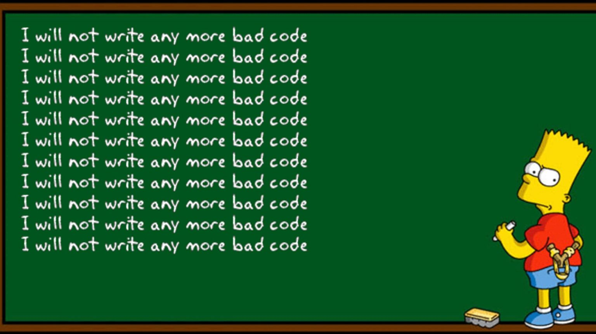
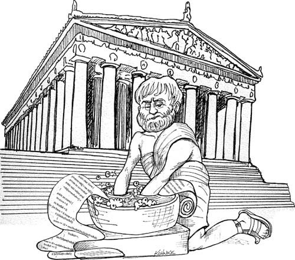

# 1장 깨끗한 코드

## 왜 나쁜 코드를 작성했을까?
- 급해서, 서두르느라, 마감기한이 얼마 남지 않아서 등...
- 일단 급한 불은 끄고 나중에 정리해야지
    - 나중은 결코 오지않는다.
    
## 나쁜 코드로 작성한 대가
- 개발 속도를 크게 떨어트린다.
- 팀 생산성을 떨어트린다.
- 재설계를 자꾸 생각하게 만든다.(=시간 증가)
- 태도의 변화 
    - 요구사항이 변했을 시 코드탓이 아닌 남탓을 하게됨
    
- 또 다른 나쁜 코드를 작성하도록 유혹함.
    
### 전문가의 태도
- 나쁜 코드의 위험을 이해하지 못하는 관리자의 말을 그대로 따르는 행동은 전문가 답지 못하다.
- 기한을 맞추는 그러니깐 생산성 향상 방법은 코드를 깨끗하게 유지하는 것이다.

## 깨끗한 코드의 정의
- `보기에 즐거운` 코드, `가독성 있는` 코드
- `철저한 오류처리`, `모든 테스트 케이스를 통과하는` 코드
- `한 가지만 하는` 코드, `작은` 코드
- `다른 사람이 고치기 쉬운` 코드
- `테스트 케이스가 있는 ` 코드
- `주의 깊게 짰다는 인상을 주는` 코드
- `중복이 없는` 코드
- `짐작했던 기능을 그대로 수행하는 ` 코드

## 깨끗한 코드를 작성해야 하는 이유
- 코드 읽는 시간  : 코드 짜는 시간 = 10 : 1
    - 즉 읽기 쉬운 코드가 시간을 줄여준다.
    
- 깨끗한 코드가 생산성이 높다.
