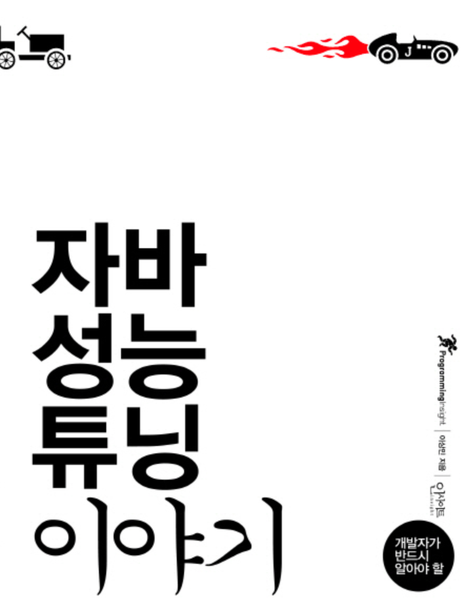
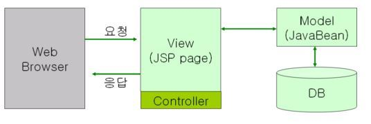
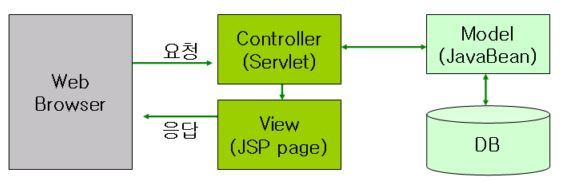
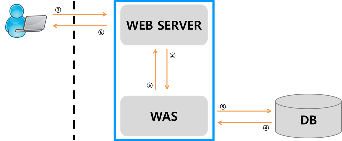

# 1.디자인패턴 꼭 써야한다.

- 디자인 패던과 UML이 첫 장인 이유
    - 아무리 자바 지식이 많더라도 디자인 패턴이나 UML으로 작성된 설계서를
    이해할 수 없다면 전체적인 큰 그림을 보지 못한다.
      
      
### MVC 모델

`MVC Model`: Model, View, Controller의 약자이다. 모델 역할, 뷰 역할, 컨트롤러 역할을 하는 클래스를 각각 만들어서 개발하는 모델.

`View`
- 사용자가 결과를 보거나 입력할 수 있는 화면. 이벤트를 발생시키고, 이벤트 결과를 보여주는 역할을 한다.

`Controller`
- 뷰와 모델을 연결시켜주는 역할을 한다. 

`Model`
- View에서 입력된 내용을 저장, 관리, 수정하는 역할을 한다. 이벤트에 대한 실질적인
일을 하는 부분이다. 

### JSP 모델1과 JSP 모델2

`모델 1`

JSP 파일 안에서 View와 Controller 역할을 모두하는 구조.

- 장점
  - 구조가 간단하여 배우기 쉽고 모델 2에 비해 짧은 시간 내에 개발이 가능하다.
  
- 단점
  - 프로세스 변경이 생길 경우 수정이 어렵다
  - 화면과 비즈니스 모델이 합쳐있어서 유지보수가 어렵다.
  
`모델 2`

JSP 모델1의 단점을 해결하기 위해서 나온 모델. MVC 모델을 정확히 따른다.

- 장점
  - 비즈니스 로직과 뷰의 분리로 유지보수와 확장이 쉽다.
  - 개발자와 디자이너 작업이 분리되어 분업이 편하다.
  - 중, 대형 프로젝트에 적합하다.
  
- 단점
  - 초기 구조설계하는데 많은 시간이 필요하다.
  - 개발자의 높은 수준을 요구한다.

### 왜 JSP 모델1,모델2 그리고 MVC 모델을 배울까?

모델 구조도 성능을 결정하는 요인 중 하나이다.

### Java EE 패턴이란?

`패턴`: 시스템을 만들기 위해 일부 의미있는 클래스들의 집합.

- `Intercepting Filter` 패턴: 요청 타입에 따라 다른 처리를 하기 위한 패턴.
- `Front Controller` 패턴: 요청 전후에 처리하기 위한 컨트롤러를 지정하는 패턴.
- `View Helper` 패턴: 프레젠테이션 로직과 상관 없는 비즈니스 로직을 헬퍼로 지정하는 패턴.
- `Composite View` 패턴: 최소 단위의 하위 컴포넌트를 분리하여 화면을 구성하는 패턴.
- `Service to Worker` 패턴: Front Controller와 View Helper 사이에 디스패처를 두어 조합하는 패턴.
- `Dispatcher View` 패턴: Front Controller와 View Helper로 디스패처 컴포넌트를 형성한다.
뷰 처리가 종료될 때까지 다른 활동을 지연한다는 점이 Service toWorker 패턴과 다르다.
  
- `Business Delegate` 패턴: 비즈니스 서비스 접근을 캡슐화하는 패턴.
- `Service Locator` 패턴: 서비스와 컴포넌트 검색을 쉽게 하는 패턴.
- `Session Facade` 패턴: 비즈니스 티어 컴포넌트를 캡슐화하고, 원격 클라이언트에서 접근할 수 있는 서비스를 제공하는 패턴.
- `Composite Entity` 패턴: 로컬 엔티티 빈과 POJO를 이용하여 큰 단위의 엔티티 객체를 구현한다.
- `Transfer Object` 패턴: 일명 Value Object 패턴이라고 많이 알려져 있다. 
  데이터를 전송하기 위한 객체에 대한 패턴이다.
- `Transfer Object Assembler` 패턴: 하나의 Transfer Object로 모든 타입 데이터를 처리할 수 없으므로,
여러 Transfer Object를 조합하거나 변형한 객체를 생성하여 사용하는 패턴.
  
- `Value List Handler` 패턴: 데이터 조회를 처리하고, 결과를 임시 저장하며,
결과 집합을 검색하여 필요한 항목을 선택하는 역할을 수행하는 패턴.
  
- `Data Access Object` 패턴: 일명 DAO이라고 많이 알려져 있다. DB에 접근을 전담하는 클래스를 추상화하고 캡슐화하는 패턴.
- `Service Activator` 패턴: 비동기적 호출을 처리하기 위한 패턴.

### 우선적으로 배워야하는 패턴

`Transfer Object 패턴`

데이터를 전송하기 위한 객체에 대한 패턴. Transfer Object를 만들어 하나의 객체에 여러 타입의 값을 전달하는 일을 수행한다.

- 필드는 getter()와 setter() 메소드를 작성하여 정보 은닉과 필드를 아무나 수정할수 없게 만든다.
- toString() 메소드를 반드시 구현하자
- Serializable 인터페이스를 반드시 구현하자(implements)
  - 이 인터페이스를 구현하면 객체를 직렬화 할 수 있다. 즉 서버 사이의 데이터 전송이 가능해진다.
  그러므로 원격지 서버에 데이터를 전송해야 하거나, 파일로 객체를 저장해야 할 경우에는 이 인터페이스를 구현해야 한다.

`Service Locator 패턴`

예전에 많이 사용했던 EJB의 EJB Home 객체나 DB의 Datasource를 찾을 때(lookup) 소요되는 응답 속도를
감소시키기 위해서 사용되는 패턴이다.

---
ASP(Active Server Pages): 동적 웹페이지를 만들기 위한 서버 측 스크립트 엔진.

Java EE(Java Platform, Enterprise Edition. J2EE): 자바를 이용한 서버측 개발을 위한 플랫폼.

### 웹 아키텍처 2 tier vs 3 tire

웹 아키텍쳐에서 3 티어가 등전하기전에는 2 티어를 많이 사용했다.

`2 tier`

- 클라이언트 <--> 서버
- 클라이언트가 직접 서버의 DB에서 접속해서 자원을 활용한다.
- 편리하지만 보안이 취약하고, 유지보수가 어렵다.

`3 tier`

- 클라이언트 <--> 서버 <--> DB

`웹 서버의 역할`

1. 클라이언트의 접속
2. 웹 애플리케이션의 비즈니스 로직
3. `DB 접근`
4. 직접 데이터를 관리하지 않음 --> DB 서버를 별도로 구성한다.

하지만, 웹어플리케이션의 사용자가 많아지면서 `웹 서버에 과부하`가 걸리는 문제가 발생 --> `WAS 서버 등장`

`각 파트의 역할`
- 클라이언트: 사용자의 PC, 웹 브라우저
- 웹 서버: 클라이언트의 요청, 접속 관리
- WAS 서버: 애플리케이션 실행(비즈니스 로직, DB접근)
- DB: 데이터베이스

---

출처 

- <https://tosiri.tistory.com/7>
- <https://haloworld.tistory.com/17>