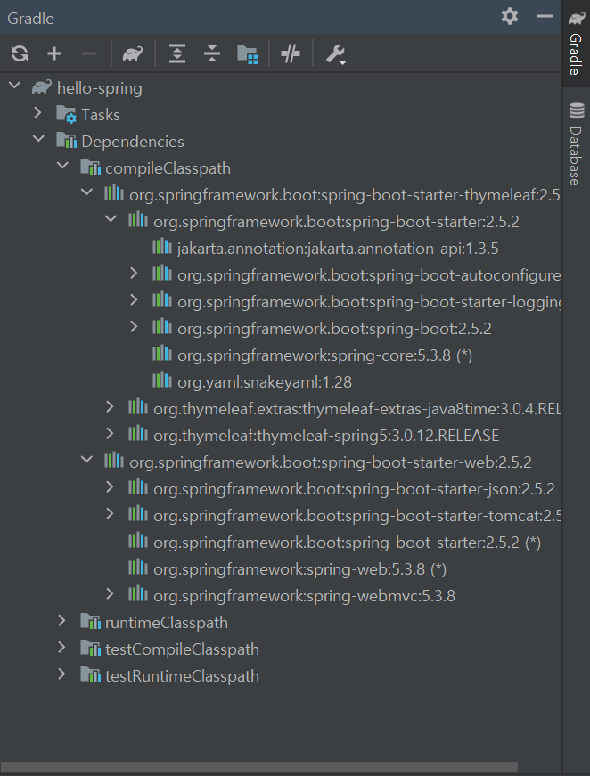

## 라이브러리 살펴보기

## gradle, marvel같은 빌드 툴
- 의존관계를 관리해줍니다.
  - 예를 들어 starter-web 라이브러리를 가져오면 이 라이브러리와 관련되고 필요한
    모든 라이브러리들을 같이 가져옵니다.
- External Libaries: 실제로 사용하는 모든 라이브러리들.
- Gradle --> Dependencies: 라이브러리 간 의존 관계.

  

