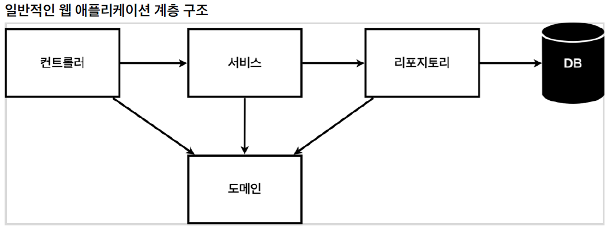
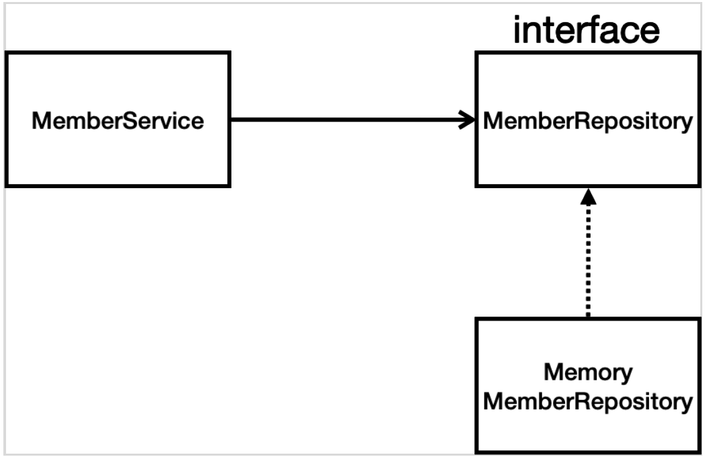

# 회원 관리 예제 - 백엔드 개발

1. 비즈니스 요구사항을 정리 
2. 회원 도메인과 리포지토리 만들기
3. 회원 리포지토리 테스트 케이스 작성
4. 회원 서비스 개발
   - 실제 비즈니스 로직이 있는 회원 서비스
5. 회원 서비스 테스트
    - 테스트: junit 테스트 프레임워크로 만듭니다. 

## 비즈니스 요구사항 정리
요구사항은 가장 간단하고 쉽게 진행할 예정입니다. 왜냐면 강의의 목표가 단순한 예제를 통해
스프링의 전반적인 생태계를 훑는 것이기 때문입니다.

- 데이터: 회원ID, 이름
- 기능: 회원 등록, 조회
- 아직 데이터 저장소(=db)가 선정되지 않았음(가상의 시나리오)
    - 일반적인 관계형db를 할지 성능이 좋은 db를 할지 nosql로 할지 결정이 안됬지만 개발은 해야되는 상황입니다.
    이런 상황을 만든 이유는 스프링의 특성을 더 잘 설명하기 위함입니다.  

### 일반적인 웹 어플리케이션 구조

- 컨트롤러: 웹 MVC의 컨트롤러 역할을 의미합니다.
- 서비스: 핵심 비즈니스 로직 구현을 의미합니다.
    - 비즈니스 도메인 객체를 가지고 비즈니스 로직을 구현합니다.
    - 예) 회원은 중복 가입이 불가능합니다.와 같은 로직들이 들어있습니다. 
- 리포지토리: 데이터베이스를 접근, 도메인 객체를 DB에 저장하고 관리합니다.
- 도메인: 비즈니스 도메인 객체를 의미합니다. 예) 회원, 주문, 쿠폰 등등 주로 데이터베이스에 저장하고 관리됩니다.

### 클래스 의존관계

- 아직 데이터 저장소가 선정되지 않아서, 우선 인터페이스로 구현 클래스를 변경할 수 있도록 설계합니다.
- 데이터 저장소는 RDB, NoSQL 등등 다양한 저장소를 고민중인 상황으로 가정합니다.
- 개발을 진행하기 위해서 초기 개발 단계에서는 구현체로 가벼운 메모리 기반의 데이터저장소를 사용합니다.